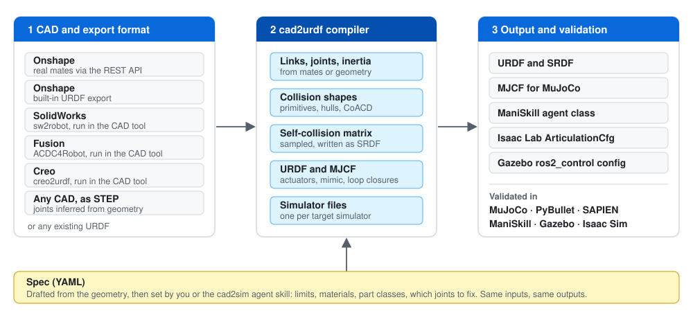

# cad-to-urdf

Turns a CAD assembly (Onshape, SolidWorks, Fusion, Creo or STEP) into simulation files for MuJoCo, Isaac Lab, Newton, ManiSkill, Gazebo and PyBullet.

| Docs | What is in it |
|---|---|
| [CAD sources](docs/cad.md) | Onshape, SolidWorks / Fusion / Creo, STEP, URDF input, static scenes |
| [Simulators](docs/simulators.md) | files per simulator, validation, viewing, per-simulator notes |
| [USD asset](docs/usd.md) | layered structure, physics variants, units, Isaac Lab and Newton |
| [Spec and outputs](docs/spec.md) | the YAML spec, part classes, collision, the output folder |
| [Testing and status](docs/testing.md) | asset tests, repo tests, robots checked, limitations |
| [Development](docs/development.md) | code layout, memory cap, determinism |
| [Research notes](docs/RESEARCH.md) | existing tools, and how each simulator reads URDF, SRDF and dynamics |
| [Onshape API keys](docs/ONSHAPE_API_KEYS.md) | getting keys for the Onshape API route |

| | |
|---|---|
|  **arm4** (STEP sample) |  **SO-100** (STEP, drafted automatically) |
|  **Orbita** (Onshape, loop closures) |  **Quadruped** (Onshape, 12 joints) |
|  **Sigmaban humanoid** (Onshape, 20 joints) |  **Open Duck Mini** (Onshape, 14 joints) |
|  **Infantry 2026** (Onshape, wheels, yaw, pitch) |  **Hero 2026** (Onshape, wheels, yaw, pitch) |

Each clip shows the visual meshes (left) and the generated collision shapes (right). The Duck and the humanoid walk with a gait computed from their geometry, the Infantry and Hero animate only their wheels, yaw and pitch, and the rest sweep their joints. All demos are in [`docs/demos/`](docs/demos); model credits are in [THIRD_PARTY.md](THIRD_PARTY.md).

## What it writes

- URDF and an SRDF with a sampled self-collision matrix
- MJCF with actuators, armature, mimic and loop constraints, contact excludes
- a USD (USDA) asset in the Isaac Sim 6.x layered structure, with `physx` and `mujoco` (Newton) variants
- a ManiSkill agent class, an Isaac Lab `ArticulationCfg`, a Gazebo `ros2_control` config
- convex collision shapes per link: primitives where they fit, CoACD where they don't
- static scenes from surface-only STEP files (competition fields)

The output is deterministic. What geometry can't tell (joint limits, materials, which joints matter) goes in a small YAML spec, drafted for you, or is decided by the [`cad2sim` agent skill](#agent-skills).

## How it works



1. **Pick a route:** CAD package, export format, target simulator. Real mates are used when the CAD has them; STEP joints are inferred from geometry.
2. **One compiler:** every route ends in the same deterministic compiler.
3. **A spec:** a small YAML file sets what the geometry can't. You or the agent skill edit it.

## Setup

Linux, Python 3.12, [uv](https://docs.astral.sh/uv/). A CUDA GPU is optional.

```bash
git clone https://github.com/arugoa/cad-to-urdf.git && cd cad-to-urdf
scripts/setup_venv.sh            # .venv with everything except Isaac Sim
scripts/setup_venv.sh --isaac    # plus Isaac Sim 6.1 (~27 GB)
cp .env.example .env             # Onshape API route only: add your keys
```

If ROS is sourced, prefix commands with `env -u PYTHONPATH`. Heavy commands run inside a memory cap ([details](docs/development.md#memory-cap)).

## Run

```bash
# STEP file: the spec is drafted from the geometry
python -m cad2urdf.route --cad solidworks --format step --sim mujoco --run \
    --input robot.step --out build/robot \
    --part-classes .agents/skills/cad2sim/part_classes.yaml

# Onshape assembly through the API (keys in .env)
python -m cad2urdf.route --cad onshape --format native --sim mujoco --run \
    --input "https://cad.onshape.com/documents/<doc>/w/<workspace>/e/<assembly>" --out build/robot \
    --part-classes .agents/skills/cad2sim/part_classes.yaml

python -m cad2urdf.validate build/robot --sims mujoco,pybullet     # does each simulator load and hold it?
python -m cad2urdf.asset_test build/robot --sims mujoco,newton     # stress tests and file cross-checks
python -m cad2urdf.sim2sim build/robot --sims mujoco,newton       # same scenario in each simulator, compared
python tests/view_urdf.py build/robot --sim mujoco                 # look at it
```

Output goes to `build/robot/`: `<robot>.urdf`, `mjcf/`, `usd/`, `isaaclab/`, `maniskill/`, `gazebo/`, `meshes/` and reports ([full list](docs/spec.md#output-folder)). Other routes, exporters and the spec format are in [CAD sources](docs/cad.md) and [Spec and outputs](docs/spec.md).

## Agent skills

`.agents/skills/cad2sim/SKILL.md` (linked into `.claude/skills/`) lets Claude Code or Codex run the whole job: pick the route, run it, resolve the REVIEW items, decide which parts are fasteners or bearings and which joints to keep, then test the asset in simulation and fix the spec until the checks pass. It edits the spec, never the generated files.

`.agents/skills/sim2sim/SKILL.md` runs the same scenario in several simulators and explains where they differ.

## License

MIT, see [LICENSE](LICENSE). Bundled and shown third-party models keep their own licenses: [THIRD_PARTY.md](THIRD_PARTY.md).
