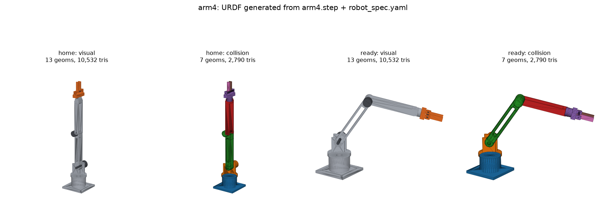
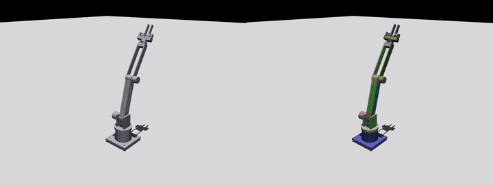
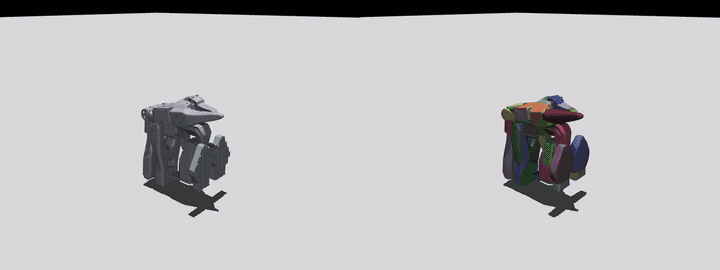
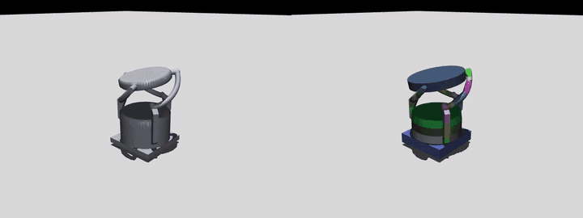
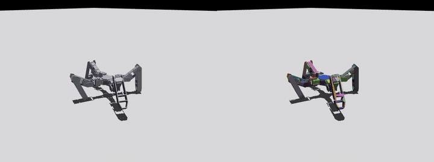
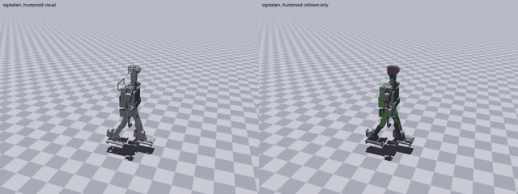
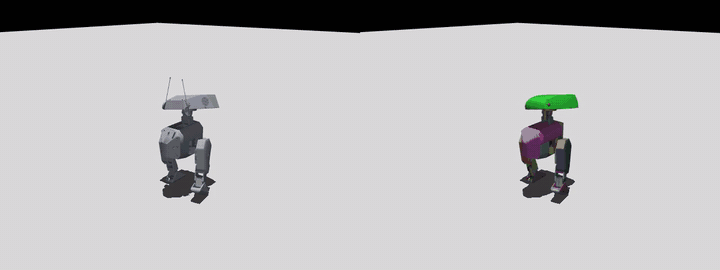
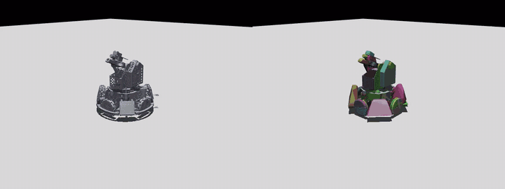
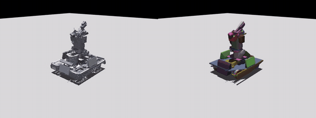

# cad-to-urdf

Converts CAD assemblies (Onshape, SolidWorks, Fusion, Creo, or plain STEP) into robot descriptions for ManiSkill, MuJoCo, Isaac Lab, Gazebo and PyBullet:

- URDF, plus an SRDF with a sampled self-collision matrix
- native MJCF with actuators, armature, mimic and loop constraints, contact excludes and keyframes
- a ManiSkill agent class, an Isaac Lab `ArticulationCfg` and Gazebo `ros2_control` config
- convex collision geometry per link (primitives where they fit, CoACD where they don't, at most 12 pieces per link)
- static scenery (competition fields) from surface-only STEP files

Everything is deterministic: the same inputs give the same outputs. What geometry can't tell you (joint limits, materials) goes in a small spec file, drafted for you, or is handled by the included [`cad2sim` agent skill](#agent-skill).



## Demos

Each clip shows the visual meshes (left) and the generated collision shapes (right) while every joint sweeps inside its limits. All 14 are in [`docs/demos/`](docs/demos); credits are in [THIRD_PARTY.md](THIRD_PARTY.md).

| | |
|---|---|
|  **arm4** (parametric sample, STEP) |  **SO-100** (STEP, drafted automatically) |
|  **Orbita** (Onshape, parallel mechanism with loop closures) |  **Quadruped** (Onshape, 12 joints) |
|  **Sigmaban humanoid** (Onshape, 20 joints) |  **Open Duck Mini** (Onshape, 14 joints) |
|  **Infantry 2026** (Onshape, trimmed to wheels, yaw and pitch) |  **Hero 2026** (Onshape, trimmed to wheels, yaw and pitch) |

## How it works

You pick the CAD package, the export format and the simulator:

```
 CAD / format          front end                    compiler                        validate
 onshape/native        Onshape REST API (mates)     links, inertia, collision,      MuJoCo, PyBullet,
 onshape/urdf-export   Onshape URDF export          SRDF, URDF, MJCF, ManiSkill,    SAPIEN, ManiSkill,
 solidworks/native     sw2robot (in SolidWorks)     Isaac Lab, Gazebo files         Gazebo, Isaac Sim
 fusion/native         ACDC4Robot (in Fusion)
 creo/native           creo2urdf (in Creo)
 */step                joints inferred from geometry, spec drafted
 urdf/native           any existing URDF
```

A front end that reads real mates is preferred, since mates say what moves. STEP keeps the shapes but not the mates, so joints are inferred from geometry. Every route ends in the same compiler. `python -m cad2urdf.route --list` prints the full matrix; [docs/RESEARCH.md §9](docs/RESEARCH.md#9-routing-cad--format--simulator) explains the choices.

## Setup

Linux, Python 3.12 and [uv](https://docs.astral.sh/uv/). A CUDA GPU is optional (ManiSkill GPU check, Isaac Sim).

```bash
git clone https://github.com/arugoa/cad-to-urdf.git && cd cad-to-urdf
scripts/setup_venv.sh            # .venv with everything except Isaac Sim
scripts/setup_venv.sh --isaac    # the same venv plus Isaac Sim 6.1 (~27 GB)
cp .env.example .env             # only for the Onshape API route: fill in your keys
```

If ROS is sourced, its `PYTHONPATH` breaks the venv: prefix commands with `env -u PYTHONPATH`.

Heavy commands run inside a memory cap: `route`, the compiler, `scene`, `validate` and the viewer re-launch themselves in the systemd user slice `cad2urdf.slice`. All cad2urdf jobs share one cap (half the RAM, no swap), run at `nice 19` and are the first thing the kernel kills if memory runs out. `CAD2URDF_RESERVE_GB` changes the cap, `CAD2URDF_NO_SANDBOX=1` turns it off, and `scripts/run_safely.sh <command>` runs any other command in the same slice.

Gazebo checks need `ros-$ROS_DISTRO-gz-ros2-control`; Isaac Sim needs about 9 GB of free RAM.

## Onshape

Two options:

- **URDF export, no setup.** Right-click the assembly tab, Export, URDF. Then run the router on the unzipped URDF with `--cad onshape --format urdf-export`.
- **Live document through the API.** cad2urdf's own client reads the mates, limits, gear relations, masses and meshes. It needs API keys in `.env`; see [docs/ONSHAPE_API_KEYS.md](docs/ONSHAPE_API_KEYS.md) (Enterprise documents need a key from an Enterprise admin). Pass the assembly tab's URL:

```bash
python -m cad2urdf.route --cad onshape --format native --sim maniskill --run \
    --input "https://cad.onshape.com/documents/<doc>/w/<workspace>/e/<assembly>" --out build/myrobot \
    --part-classes .agents/skills/cad2sim/part_classes.yaml
```

Naming conventions from onshape-to-robot are honoured: if any mate is named `dof_*`, only those mates are joints (`_inv` flips the axis); `closing_*` mates close loops; joints named `*passive*` get no actuator and `*_speed` a velocity actuator; `frame_*` parts are markers. Planar mates between the same two bodies are combined (one is two slides and a spin, two give a slide, three fix the part). A mate to the assembly origin moves the body against the grounded part. A part in the `fastener` class that is mated to something stays fixed to it. Responses are cached in `~/.cache/cad2urdf/onshape`.

## Usage

Outputs go to `build/`, which is git-ignored and can always be regenerated.

```bash
python -m cad2urdf.route --cad onshape --format native --sim maniskill        # show the plan only

python -m cad2urdf.route --cad solidworks --format step --sim maniskill --run \
    --input robot.step --out build/robot [--spec overrides.yaml] \
    --part-classes .agents/skills/cad2sim/part_classes.yaml                   # STEP: spec drafted from geometry

python -m cad2urdf.route --cad fusion --format native --sim mujoco --run \
    --input exported/robot.urdf --out build/robot                             # an exporter's URDF

python -m cad2urdf examples/arm4/robot_spec.yaml -o build/arm4                # your own full spec
python -m cad2urdf.scene field.step -o build/field                            # static scene + drop test
python -m cad2urdf.validate build/robot --sims mujoco,pybullet,sapien,maniskill,gazebo
python -m cad2urdf.step robot.step                                    # part groups and joint axes
```

Every route writes every output; `--sim` only picks collision defaults and which checks run. The main file per simulator:

| `--sim` | load |
|---|---|
| `maniskill` | `maniskill/<robot>_agent.py` |
| `mujoco` | `mjcf/<robot>.xml` |
| `isaaclab` | `isaaclab/<robot>_cfg.py` |
| `gazebo` | `gazebo/<robot>.gazebo.urdf` and `gazebo/config/controllers.yaml` |
| `pybullet` | `<robot>.urdf` with `URDF_USE_INERTIA_FROM_FILE` |

### Viewing

```bash
python tests/view_urdf.py build/robot                    # browser (viser): joint sliders, collision toggle
python tests/view_urdf.py build/robot --sim mujoco       # MuJoCo viewer; keys 2/3 toggle visual/collision
python tests/view_urdf.py build/robot --sim maniskill    # SAPIEN viewer
python tests/view_urdf.py build/robot --sim isaac        # Isaac Sim window (close other apps first)
python tests/view_urdf.py build/robot --sim maniskill --scene build/field --at 0 0 0.02
```

Loop closures (Orbita, the Haro pump) only exist in the MJCF, so use `--sim mujoco` for those robots.

## Outputs

```
build/robot/
├── <robot>.urdf, <robot>.srdf
├── mjcf/<robot>.xml
├── maniskill/<robot>_agent.py
├── isaaclab/<robot>_cfg.py
├── gazebo/<robot>.gazebo.urdf, gazebo/config/controllers.yaml
├── meshes/visual/*.stl           per link and material, at most 100k triangles per file
├── meshes/collision/*.stl        one convex piece each (at most 64 vertices)
├── robot_spec.yaml               the spec used
├── robot_spec.draft.yaml         STEP only: the draft with its REVIEW notes
├── report.json                   joint candidates, masses, collision fit per link, joint-limit sweep
└── validation.json               what each simulator loaded and did
```

## The spec

For STEP input the spec is drafted and every guess is marked `# REVIEW`. Pass corrections with `--spec`; they're merged over the draft:

```yaml
materials: {aluminum: 2700, steel: 7850, pla: 1240}          # kg/m^3
part_materials: {"*bolt*": steel, "*": aluminum}              # first match wins; a "*" fallback is required
part_classes: {fastener: ['hold-down clamp'], servo: ['^st3215']}   # name regexes, merged per class over the library
joints:
  base_to_turret: {limits: [-2.97, 2.97], effort: 40, velocity: 3}
  gripper_to_finger_2: {mimic: {joint: gripper_to_finger}, axis_sign: -1}
dynamics:  {default: {damping: 0.5, friction: 0.05, armature: 0.01}}
actuators: {default: {kind: position, kp: 200, kv: 10}, gripper_to_finger_2: {kind: none}}
collision: {default: {mode: auto, max_geoms: 12}, finger: {mode: decompose}}
simplify:  {drop_fasteners: true, visual_faces_per_link: 20000}   # or `simplify: false`
root_rpy:  [1.5708, 0, 0]                                     # Y-up export -> Z-up
closures:                                                     # loops a URDF tree can't hold
  pump_hinge: {link1: upper_arm, link2: pump_rod, point: [14.91, 88.89, 51.34]}   # CAD units
srdf: {group_states: {home: {group: arm, joints: {base_to_turret: 0}}}}
```

When the draft can't find the joints (motors butted flat against a link, zero-clearance pivots), write the links and joints yourself with axes from `python -m cad2urdf.step`. [`examples/step/Haro380.spec.yaml`](examples/step/Haro380.spec.yaml) is a worked example (it needs your own copy of the Haro380 STEP file).

### Part classes

The code has no built-in knowledge of part names. It treats a part as a fastener, bearing, gear, servo, non-physical solid or placeholder only if the spec's `part_classes:` lists a pattern for it. [`.agents/skills/cad2sim/part_classes.yaml`](.agents/skills/cad2sim/part_classes.yaml) is the default pattern library; pass it with `--part-classes`, and add or override classes per robot in the spec. Without it nothing is dropped as a fastener and no bearing, servo or gear is recognised. Fasteners are removed from visuals and collision (their mass stays) and their mates never become joints.

Collision modes: `none`, `box`, `spheres`, `primitives`, `hull`, `auto` (default), `decompose`, `keep` (an input URDF's own collisions). Exporter URDFs also take `package_dirs` to resolve `package://` paths.

## Agent skill

`.agents/skills/cad2sim/SKILL.md` (linked into `.claude/skills/`) lets Claude Code or Codex run a conversion end to end. The agent picks the route, runs it, resolves the REVIEW items (asking you for limits and materials), and iterates on `validation.json`. It only edits the spec, never the generated files. It also owns the judgment calls the code leaves out: which parts are fasteners or bearings (`part_classes`), and which generated joints to fix.

## Repository layout

```
cad2urdf/
  route.py         router CLI and routing table
  step.py          STEP front end: loading, joint inference, spec draft, inspector (python -m cad2urdf.step)
  frontends.py     Onshape API and exporter-URDF front ends
  model.py         intermediate representation
  geometry.py      visual decimation, collision modes and budget, joint-limit sweep
  writers.py       URDF, MJCF, SRDF, Isaac Lab / ManiSkill / Gazebo side files
  scene.py         static scenes and drop test
  validate.py, isaac_probe.py   simulator checks
  util.py          memory sandbox and shared helpers
.agents/skills/cad2sim/   the agent skill: SKILL.md and part_classes.yaml (name patterns the code does not hold)
examples/                 arm4 (parametric sample), sigmaban, step (Kaya base, a Haro380 spec)
tests/                    pytest suite and view_urdf.py
docs/                     RESEARCH.md, ONSHAPE_API_KEYS.md
scripts/                  setup_venv.sh, run_safely.sh
```

## Tests

```bash
pytest -q
```

About 5 seconds. Covers joint inference, inertia, collision fitting, the SRDF matrix, the STEP draft, the URDF round trip, `root_rpy`, loop closures, fastener detection, and the Onshape front end against a fake API.

## Status

Tested on an RTX 3070 Ti laptop with Ubuntu 22.04.

| Input | Result |
|---|---|
| 7 public Onshape robots | joint counts match the references: 2-wheeler 2, adjustable arm 4, quadruped 12, dog 12, Sigmaban 20, Orbita 7 (+2 loop closures), RSK soccer 64 |
| Open Duck Mini v2 (Onshape) | 14 joints; runs in MuJoCo and PyBullet |
| SO-100 arm (STEP) | drafted automatically: 7 links, 6 joints |
| Haro380 arm, printed parallel gripper, Ender 3 V2 (STEP, tested locally, not bundled) | Haro380: hand-finished spec with 6 joints and the gas-spring loop; gripper: 5 links, 4 pivots, four-bar loops reported; Ender 3: no joints (slides aren't detected) |
| Kaya base (STEP) | one solid, no joints |
| ARC 3v3 field (surface-only STEP) | 925 collision shapes; 0 of 400 drop-test balls fall through |
| Triton Infantry 2026 (Onshape, 101 parts) | 62 links, 61 joints: wheels, yaw, pitch and flywheels from the real mates, plus extra bearing/collar joints for the agent to fix; the STEP draft of the same robot is wrong |
| 1,000-part robots from STEP | drafts are unreliable; use the Onshape route |

Checked simulators: MuJoCo (URDF and MJCF), PyBullet, SAPIEN, ManiSkill 3 (CPU and GPU), yourdfpy, Gazebo Classic 11 (headless) and Isaac Sim 6.1 (headless import and stepping).

Limitations:
- STEP has no mates. Shaft/bore fits, loose pins, bearings, servo horns, gears and press fits are recognised; joints the CAD doesn't model come out rigid.
- Joint limits and real masses aren't in STEP geometry; set them in the spec.
- Loop closures reach the MJCF only; URDF-based simulators need them added by hand.
- Which generated joints are real mechanisms, and which parts are fasteners or bearings, are judgment calls kept out of the code: the agent skill makes them (see [Agent skill](#agent-skill)).

[docs/RESEARCH.md](docs/RESEARCH.md) has the survey of existing tools and how each simulator reads URDF, SRDF and dynamics.

## License

MIT, see [LICENSE](LICENSE). Bundled and demonstrated third-party models keep their own licenses: see [THIRD_PARTY.md](THIRD_PARTY.md).
