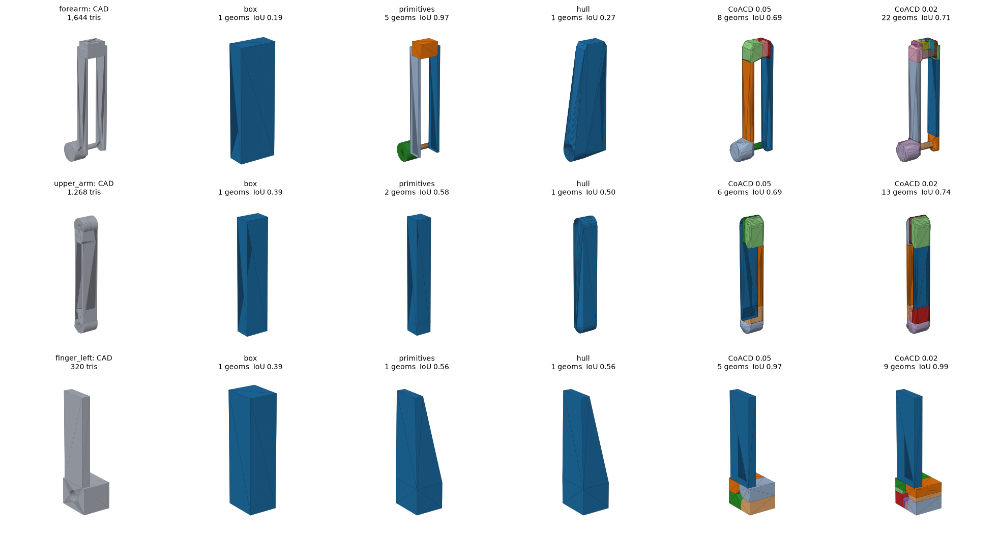

# CAD → URDF/SRDF: research notes

*Status: September 2026. Covers existing tools, AI-model capabilities, joint identification per CAD package, collision geometry for multi-part assemblies, how dynamics reach each simulator, and how URDF/SRDF needs differ between simulators. The implementation (`cad2urdf/`) and sample (`examples/arm4/`) back the claims tagged (verified).*

Evidence tags:
- (verified): reproduced in this repo by loading generated files in the simulator or reading its source.
- (sourced): from the linked page; several vendor pages were blocked here, so some AI-capability numbers come from search excerpts.
- (unverified): background knowledge, not re-checked; confirm against current docs.

---

## Contents

0. [Key findings](#0-key-findings)
1. [What "simulation-ready" means](#1-what-simulation-ready-means)
2. [Existing tools](#2-existing-tools)
3. [AI models, MCP servers and CAD](#3-ai-models-mcp-servers-and-cad)
4. [Identifying joints in each CAD package](#4-identifying-joints-in-each-cad-package)
5. [Collision geometry for multi-part assemblies](#5-collision-geometry-for-multi-part-assemblies)
6. [How dynamics get into each simulator](#6-how-dynamics-get-into-each-simulator)
7. [How URDF/SRDF needs differ per simulator](#7-how-urdfsrdf-needs-differ-per-simulator)
8. [Worked sample: `arm4` (CAD → URDF/SRDF/MJCF)](#8-worked-sample-arm4)
9. [Routing: CAD × format × simulator](#9-routing-cad--format--simulator)
10. [Proposed architecture for this project](#10-proposed-architecture)
11. [Sources](#11-sources)

---

## 0. Key findings

1. Every CAD package already has at least one exporter, but they are one-to-one and one-size-fits-all. Onshape (native URDF export since v1.212, Mar 2026, plus `onshape-to-robot` v1.8.3), SolidWorks (`sw_urdf_exporter`, and the newer `sw2robot`/`solidworks_urdf_exporter2`), Fusion (`fusion2urdf` forks, ACDC4Robot) and Creo (`creo2urdf`) are covered. None of them provides per-link collision granularity, a sampled SRDF, and simulator-specific dynamics together. Only `onshape-to-robot` comes close. The gap is the multi-target compiler, not the CAD reader.
2. Joints are recoverable three ways, from best to worst: (a) native mates or joints through the CAD API, (b) naming conventions in the CAD tree (`dof_*` in Onshape, `*_CSYS` in Creo), (c) geometric inference from a mate-less STEP file. We implemented (c). On the sample it recovers all 6 joints' axes and origins from shaft-in-bore geometry alone. It correctly flags the linear rail as ambiguous ("cylindrical": slide *or* spin), which a spec then resolves (verified).
3. No single collision strategy wins. On the sample, per-part primitives beat CoACD for plate-and-pin links: forearm IoU 0.97 vs 0.69 at the same budget. CoACD wins for L-shaped fingers (0.97 vs 0.56). Whole-link hulls and boxes are poor for anything non-convex (IoU 0.2–0.6) (verified). So collision mode must be a per-link choice, and it should be scored automatically.
4. URDF cannot carry most of the dynamics. It has mass, COM, inertia, `damping`, `friction`, effort and velocity limits. It has no armature, actuator gains or models, contact or friction material, or restitution. Each simulator takes these through its own side channel: MJCF, `ArticulationCfg`, ManiSkill agent class, `<gazebo>` tags + ros2_control, `changeDynamics`, `drake:` tags. The converter should emit those side files from one IR instead of patching a URDF.
5. Simulators read the same URDF differently. Five surprises we reproduced:
   - MuJoCo 3.14 imports URDF `<mimic>` as an equality constraint, but drops armature and fuses a fixed root link into the world. It then *does not* filter contacts between the base and the first moving link. You need explicit `<exclude>`s (verified).
   - PyBullet silently recomputes inertia from collision shapes unless `URDF_USE_INERTIA_FROM_FILE` is set. That was a 60% error on our arm (verified).
   - SAPIEN/ManiSkill reads the SRDF automatically but only honours `disable_collisions reason="Default"`, with a 32-group cap (verified).
   - Isaac Lab's URDF importer defaults to `self_collision=False` and a single `collision_type` for the whole robot (verified, sourced).
   - Gazebo lumps fixed joints and needs `<gazebo>` tags for friction and contact (sourced).
6. AI models can now drive CAD directly. There is Claude ↔ Fusion (official MCP, Apr 2026), Onshape's official FeatureScript MCP server (Aug 2026), and OpenAI's GPT-6 Astra (Sep 3 2026), which led its launch with CAD results (sourced). Reported assembly-level performance is still weak: ~15% pass rates on assembly tasks, plus "looks right, isn't" failure modes (sourced). The practical role for an LLM in this project is to author and repair the spec and to write CAD-API extraction scripts. It should *not* compute geometry, inertia or transforms. A deterministic compiler does that, with a validation loop feeding errors back.

---

## 1. What "simulation-ready" means

A checklist the converter must satisfy. Each item links to the section that covers it.

| # | Requirement | Why it bites | § |
|---|---|---|---|
| 1 | Kinematic tree with one root; loops closed by constraints | URDF is tree-only; loops need MJCF `<equality>`, USD joints excluded from the articulation, etc. | 4.8 |
| 2 | Link = rigid group of parts, not one link per part | One link per part multiplies bodies and contacts, and hurts solver stability and speed | 4.7 |
| 3 | Correct joint frames: origin on the axis, axis unit-length, sign convention | CAD mate frames are arbitrary. URDF requires child frame = joint frame | 4 |
| 4 | SI units (m, kg, s, rad) | CAD is mm or inch. Fusion's API is cm. Inertia scales with L², so errors are huge | 8 |
| 5 | Mass/COM/inertia physically valid (PD, triangle inequality), from real densities, with overrides for purchased parts | MuJoCo refuses invalid inertia. PyBullet ignores it without a flag. CAD densities are often defaults | 6 |
| 6 | Visual meshes at sane tessellation, in formats every target reads (STL/OBJ; GLB for SAPIEN) | DAE is unsupported in MuJoCo. Huge meshes slow loading | 7 |
| 7 | Collision geometry convex-only, vertex-capped (≤ 64 for PhysX GPU), primitives where they fit | All engines convexify dynamic meshes, so concave meshes collide wrongly | 5 |
| 8 | Self-collision matrix (SRDF `disable_collisions`) | Adjacent links overlap at the joint by design | 5.6, 7 |
| 9 | Joint limits, effort, velocity | Planners and RL need them; CAD limits exist only in some tools | 4 |
| 10 | Joint dynamics & actuators (damping, friction, armature, PD gains / motor models) | Not expressible in URDF; per-sim | 6 |
| 11 | Contact parameters (friction, restitution, solver softness) | Per-sim, and absent from URDF | 6 |
| 12 | Semantic info (groups, end effectors, named poses, passive joints) | SRDF for MoveIt; keyframes/init_state for sims | 7 |

---

## 2. Existing tools

### 2.1 CAD-specific exporters

| CAD | Tool | How joints are found | Outputs | Collision handling | Notes |
|---|---|---|---|---|---|
| Onshape | Native URDF export (v1.212, Mar 13 2026; v1.215 added mate limits, frames, TCPs) (sourced) | Assembly mates → URDF joints; mass props → inertia | URDF + STL/GLTF | Tessellation quality adjustable; no decomposition noted | Also available through the translations REST endpoint in one call (sourced) |
| Onshape | onshape-to-robot (Rhoban, v1.8.3, Aug 2026) (verified) read source | Mate connectors named `dof_*` (revolute/cylindrical → revolute, slider → prismatic, fastened → fixed, ball → ball); `frame_*`, `fix_*`, `closing_*`, `link_*` names; `_inv` flips the axis; gear relations → mimic/equality | URDF, SDF, MJCF | Processors: merge STLs per link, simplify STLs (pymeshlab), CoACD convex decomposition, OpenSCAD pure-shape approximation, collision-as-visual | The most complete open tool. Handles kinematic loops (`closing_*` → MuJoCo `<equality>`) (verified) |
| Onshape | UrbanMachine `onshape-urdf-exporter`; K-Scale `kscale-onshape-library` (sourced) | Fork/derivative of onshape-to-robot conventions | URDF (+MJCF in K-Scale) | STL | |
| Onshape | Onshape → Isaac Sim (PTC + NVIDIA, GTC Mar 2026) (sourced) | Mates preserved through USD export | USD | Isaac-side | Also Isaac Sim's own "Onshape Importer" extension (sourced) |
| SolidWorks | sw_urdf_exporter (ros/solidworks_urdf_exporter) (sourced) | User builds the link tree in a wizard and picks reference axes or coordinate systems per joint | URDF + ROS1 package (ROS2 needs manual fixes or a web converter) | Mesh as-is | Long-lived, Windows-only |
| SolidWorks | sw2robot / solidworks_urdf_exporter2 (JSK, Apache-2.0, 2026) (sourced) | Infers tree and axes from mates; browser editor to flip or fix | URDF, MJCF, ROS package | Live self-collision highlight, auto joint-limit sweep, foot contact spheres | Extract on Windows+SW; edit and export cross-platform |
| SolidWorks | ycpss91255-research fork: collision post-processing study (sourced) | — | — | Says don't simplify in SW; post-process instead: CoACD (0.02 → 54 pieces, 145 s; 0.05 → 28 pieces but *dropped thin features*), hand boxes; mass was over-estimated ~4× by default CAD density | Good real-world evidence for §5 and §6 |
| Fusion | fusion2urdf (syuntoku14) and forks (e.g. Adriaeik/fusion2URDF with xacro + ros2_control; newtonjeri) (sourced) | Fusion joints (rigid/revolute/slider) | URDF (+ROS2 package) | Mesh as-is | Needs the `base_link` naming convention |
| Fusion | ACDC4Robot (Autodesk App Store) (sourced) | Joints: rigid, revolute, slider only; rigid groups cause problems | URDF, SDFormat, MJCF | — | `acdc4robot-fix` adds nested components and convex-decomposition collision (sourced) |
| Fusion | fusion360descriptor (cadop) (sourced) | Joints | URDF | | |
| Creo | creo2urdf (IIT, mesh-iit/icub-tech-iit) (sourced) | Creo mechanism connections + YAML/CSV config; CSYS named `PARENT_CHILD_INTERFACE_CSYS` by convention | URDF + STL | — | Revolute, prismatic, fixed only; ball → 3 revolutes with massless links. Needs a Creo Toolkit licence |
| Creo | simmechanics-to-urdf (legacy) (sourced) | Via Simscape Multibody Link | URDF | | Only MATLAB ≤ R2017b and Creo ≤ 8; unmaintained |
| Any (STEP) | step2urdf (edsamsankey, MIT) (sourced) | Auto joint origin from a shared shaft/pin/bore; user groups parts into links | URDF + ROS pkg | Mesh, `box`, or none | Exact B-rep mass props (OCP). Small project (12 commits) |
| Any (STEP) | step2urdf (Democratizing-Dexterous, web app, 239★) (sourced) | "Detects arcs and line segments" to define revolute/prismatic joints | URDF | — | |
| Any (STEP) | urdf_from_step (ReconCycle), urdf_creator (sourced) | Keywords in part names ("joint", "link") | URDF + ROS pkg | — | |
| Blender | Phobos (DFKI) (sourced) | Manual WYSIWYG | URDF, SDF, SMURF | Manual primitives | Good for hand-authoring |
| Isaac Sim | CAD Converter, Robot Wizard (beta, 6.0) (sourced) | Robot Wizard: define hierarchy, joints, drives, colliders by hand | USD | Collider approximations in PhysX | Best for "few links, few joints" |

### 2.2 Mesh and collision tools

| Tool | What it does | Where it's used |
|---|---|---|
| CoACD (MIT, `pip install coacd`) | Approximate convex decomposition with collision-aware concavity metric + MCTS; `threshold`, `max_convex_hull`, `max_ch_vertex`, `decimate` (verified) | onshape-to-robot, SAPIEN (`multiple_collisions_decomposition="coacd"`), ManiSkill, Genesis, this repo |
| V-HACD v4 (unverified) | Voxel-based approximate convex decomposition | Isaac Sim "convex decomposition" collider (PhysX cooking), PyBullet `p.vhacd` |
| MuJoCo compiler (unverified) | Takes the convex hull of every mesh geom; `maxhullvert` caps it | MuJoCo, MJX, MuJoCo Warp |
| PhysX cooking (unverified) | Convex hull ≤ 255 verts (CPU), ≤ 64 for GPU; SDF triangle-mesh colliders (expensive) | Isaac Sim/Lab, SAPIEN/ManiSkill |
| foam (CoMMA Lab), bubblify (sourced) | Sphere approximation of URDF geometry (medial-axis etc.); up to 100× faster signed-distance queries | cuRobo / motion planning |
| cuRobo(V2) sphere fitting (MorphIt) (sourced) | Per-link sphere counts & fits | GPU motion planning |
| onshape-to-robot SCAD processor (verified) | Human-authored boxes/spheres/cylinders in OpenSCAD next to each STL | Hand-tuned pure shapes |
| trimesh / pymeshlab / fast-simplification | Hulls, OBB/cylinder/sphere fits, decimation, repair (verified) | This repo (trimesh) |
| obj2mjcf, mujoco_ros2_control URDF→MJCF tool (sourced), `urdf2mjcf` (unverified) | Mesh splitting/format conversion for MuJoCo, URDF→MJCF | MuJoCo users |

### 2.3 Format bridges

- URDF → MJCF: MuJoCo compiles URDF directly (with the caveats in §7). You can `mj_saveLastXML` for a starting MJCF. The ros2_control MuJoCo integration ships a URDF→MJCF tool (sourced). Newton reads URDF, MJCF and USD directly (sourced).
- URDF → USD: Isaac Sim URDF importer (Isaac Lab `UrdfConverterCfg`) (verified) source. Isaac Lab `main` also has `MjcfConverterCfg` / `MjcfFileCfg` (verified) source.
- URDF → SDF: `sdformat` parser inside Gazebo; `<gazebo>` extension tags carry SDF-only data (sourced).
- SRDF: MoveIt Setup Assistant (GUI) builds the self-collision matrix by sampling (default 10,000 poses): Adjacent / Default / Always / Never (sourced). No official headless CLI was found, so this repo implements the same algorithm (§5.6).

### 2.4 Gaps across the landscape

1. Collision granularity is global, not per link. Exporters give "mesh", "hull" or "decomposition" for the whole robot. Isaac Lab's importer also has one `collision_type` for everything; a per-link option is an open proposal (IsaacLab #4213) (sourced).
2. No tool scores its collision output (IoU, coverage, penetration at rest), so thin-feature loss goes unnoticed. The SolidWorks study above found CoACD@0.05 silently dropped features (sourced).
3. SRDF is almost always hand-made or produced with the MoveIt GUI.
4. Dynamics beyond URDF (armature, gains, friction materials) are left to the user for every simulator.
5. Mass is trusted blindly from CAD densities (the 4× pallet example) (sourced).
6. STEP-only workflows lose all mates, and most tools then fall back to manual joint entry.

---

## 3. AI models, MCP servers and CAD

### 3.1 How models reach CAD today

| CAD | Official AI/MCP route | Community MCP servers | What an agent can actually do |
|---|---|---|---|
| Fusion | Autodesk Fusion MCP: local server inside a running Fusion (docs, run scripts, inspect errors). Claude ↔ Fusion connector announced by Autodesk & Anthropic on Apr 28 2026 alongside a Blender connector ("Claude for CAD"). Fusion Compute MCP (cloud, public beta, 7,000+ endpoints via Fusion's TypeScript API) (sourced) | frankhommers/autodesk-fusion-mcp (add-in, Streamable HTTP) (sourced) | Sketch/extrude/fillet/export; read components, joints, physical properties through the Fusion API; run Python scripts |
| Onshape | FeatureScript MCP Server (Onshape Labs; PTC press release Aug 13 2026) for Claude/ChatGPT/Gemini: write, test and debug custom FeatureScript features (sourced). Native URDF export via REST (sourced) | hedless/onshape-mcp, altendky/onshape-mcp, Casys-AI/mcp-onshape (100 tools, 14 categories), jarvis-onshape-mcp (Claude Code plugin) (sourced) | REST: assemblies, mates, mate connectors, mass properties, translations (incl. URDF); FeatureScript for custom features |
| SolidWorks | None found | just1step/solidworks-mcp (Windows COM hub), eyfel/mcp-server-solidworks, a 57-tool server with build123d + COM, API-docs servers (sourced) | Open/save, dimensions, features, mates via COM; export STEP |
| Creo | Creo 13 AI Assistant (Jun 2026) is guidance chat, not an automation API (sourced) | CREOSON MCP interface (tested with Claude Code driving Creo over the network), `creo-mcp` on PyPI (sourced) | Through CREOSON's JSON API: open models, parameters, export; mechanism access is limited compared with Toolkit |
| Code-CAD | — | build123d/CadQuery servers (sourced) | Full parametric control. This repo's sample is written this way |

### 3.2 Frontier-model CAD capability (as reported)

- OpenAI GPT-6 "Astra" launched Sep 3 2026. Its launch post reportedly led with CAD (sourced). Reported numbers, with caveats:
  - BenchCAD: vendor-reported 95.9% for Astra vs 84.3% self-reported for Claude Fable 5.1 (voxel IoU, "not re-graded"). A leaderboard aggregator lists Claude Opus 5.5 top at 0.730 on its own grading. These numbers are not comparable with each other (sourced).
  - CAD Arena (independent; six models building real parts in Siemens NX, SolidWorks, Onshape, Fusion and build123d): Astra 0.671 vs Fable 5.1 0.662 average, Astra best in Onshape (0.723) (sourced).
  - Demos include a tendon-driven robot hand, work inside an existing Onshape rover project, and a pipeline writing objects as programs in a Blender DSL that outputs MJCF/URDF with joints (sourced).
- Anthropic Claude. Official Fusion and Blender connectors (Apr 2026) and Onshape FeatureScript MCP support (Aug 2026) (sourced). Community MCP servers for all four CAD packages work with Claude Code (sourced).
- Known failure modes (analyses of Astra/BenchCAD) (sourced):
  - Assembly-level pass rates around 15%.
  - Features milled in the wrong reference frame, and stale face selections.
  - Components piled up at the origin.
  - Parts that look right but can't be made.
  - A BenchCAD case scoring 96.1% similarity where the requested edit wasn't actually made.
  - No public GD&T benchmark.

### 3.3 Research on generating articulated models

| Work | Input → output | Relevance |
|---|---|---|
| Articulate-Anything (2025) (sourced) | text/image/video → VLM writes Python → URDF | "LLM writes a program, a compiler makes URDF" is the same split we recommend |
| URDF-Anything (2025), URDF-Anything+ (2026) (sourced) | point cloud / single image → 3D MLLM or autoregressive diffusion → URDF (parts + joints) | Joint inference from geometry, but for *objects* (PartNet-Mobility), not CAD mechanisms |
| ArtiWorld (2025), ArtLLM (CVPR 2026) (sourced) | point clouds + LLM priors → URDF | Same |
| AutoMate (2021) (sourced) | dataset + learning for automatic mating of CAD assemblies | Directly relevant to inferring mates from B-rep |
| IndustryForge-27B (2026) (sourced) | domain multimodal model for industrial CAD | Possible fine-tune base |

### 3.4 What this means for the project

| Task | LLM (Claude/Astra) | Deterministic code |
|---|---|---|
| Read assembly structure, mates and names through MCP/APIs | yes drives the API, writes extraction scripts | runs the scripts |
| Group parts into links; name links and joints; choose joint semantics for ambiguous interfaces | yes proposes the spec from names, geometry reports and renders | validates coverage and uniqueness |
| Joint axes, origins, transforms, units | no (frame errors are the #1 reported failure) | yes from mates or B-rep (§4) |
| Mass, COM, inertia | no | yes from B-rep × density, with overrides |
| Collision geometry | chooses the mode per link from the scored study | yes generates and scores it |
| Dynamics parameters | drafts from datasheets (rotor inertia, gear ratio) | yes computes armature = J·N², checks units |
| Debug a simulator load failure | yes reads errors and edits the spec | re-runs validation |

The loop is: LLM writes or edits `robot_spec.yaml` → `cad2urdf` compiles → `cad2urdf.validate` loads it in every simulator → errors and metrics go back to the LLM. Everything in this repo can be driven that way from Claude Code today.

---

## 4. Identifying joints in each CAD package

### 4.1 Principle: mates → remaining degrees of freedom → joint

A joint is the set of DOF *remaining* between two rigid groups after all mates are applied. Some systems store one mate per joint (Onshape, Fusion, Creo mechanism connections). Others need you to combine several constraint mates (SolidWorks standard mates). Mapping to targets:

| Remaining DOF | Onshape mate | SolidWorks | Fusion joint | Creo connection | URDF | MJCF | Isaac/USD |
|---|---|---|---|---|---|---|---|
| 0 | Fastened | Lock / fully constrained / same sub-assembly | Rigid, rigid group | Rigid, Weld | `fixed` (or merge) | same body | fixed / merged |
| 1 rot | Revolute | Hinge, or Concentric + Coincident | Revolute | Pin | `revolute`/`continuous` | `hinge` | RevoluteJoint |
| 1 trans | Slider | Slider mate, or two Parallel/Coincident + … | Slider | Slider | `prismatic` | `slide` | PrismaticJoint |
| 1 rot + 1 trans (same axis) | Cylindrical | Concentric alone | Cylindrical | Cylinder | no → revolute+prismatic chain with a massless link, or pick one | `hinge` + `slide` in one body | two joints |
| 3 rot | Ball | (coincident point) | Ball | Ball / Gimbal | no → 3 revolutes (creo2urdf does this) | `ball` | SphericalJoint |
| planar | Planar | Coincident (plane) | Planar | Planar | `planar` (poorly supported) | `slide`+`slide`+`hinge` | D6 |
| coupled | Gear / rack-pinion / screw relations | Gear, Rack-Pinion, Screw, Linear coupler | Motion links | Gear pairs, cams | `<mimic>` | `<equality joint polycoef>` | mimic joint (Isaac 5+) (unverified) |
| loop | Mate that closes a cycle | any | any | any | no | `<equality connect/weld>` | extra joint excluded from articulation |

### 4.2 Onshape

- Data source: `GET /api/assemblies/d/{did}/{w|v|m}/{wvmid}/e/{eid}?includeMateFeatures=true` returns `rootAssembly.features[]`. Each mate has `featureData.mateType` (`FASTENED`, `REVOLUTE`, `SLIDER`, `CYLINDRICAL`, `PIN_SLOT`, `PLANAR`, `BALL`, `PARALLEL`) and two `matedEntities`, each with `matedOccurrence` (path of instance ids) and `matedCS` (origin + x/y/z axes). Joint axis is +Z of the mate frame. `/assemblies/.../features` gives mate parameters including `limitsEnabled`, `limitAxialZMin/Max`. `/matevalues` gives the current positions. Occurrence transforms come from `rootAssembly.occurrences[].transform`. Mass properties come from the parts `massproperties` endpoint (verified) (read in onshape-to-robot's client).
- Link grouping: top-level instances = links (onshape-to-robot); sub-assemblies are rigid by default; `FASTENED` mates merge links.
- Tree direction: mates are undirected. Pick the root (first instance, or the *Fixed* instance) and BFS. onshape-to-robot asks you to select the child first when creating a mate (verified).
- Two options: (1) the native URDF export when defaults are fine; (2) the REST API (or onshape-to-robot's `Assembly` class as a library) when you need control. The native exporter currently gives no collision decomposition, SRDF or sim-specific dynamics (sourced).

### 4.3 SolidWorks

- Data source: COM API (Windows only; Python via `pywin32`). Walk the `MateGroup` feature → sub-features → `IMate2`. Each gives `.Type` (`swMateType_e`: COINCIDENT, CONCENTRIC, PARALLEL, DISTANCE, ANGLE, HINGE, SLIDER, GEAR, RACKPINION, SCREW, LOCK, …) and `MateEntity(i)` → `ReferenceComponent` and `EntityParams` (point, axis, radius for cylindrical entities). Limit mates expose min/max variations. Mass properties come from `IModelDocExtension.CreateMassProperty2` in SI units (unverified).
- Joint inference: for each pair of components, combine the mates. HINGE → revolute; CONCENTRIC + planar COINCIDENT → revolute; SLIDER → prismatic; CONCENTRIC only → cylindrical; LOCK / fully defined → fixed. sw2robot does this automatically (sourced). The original sw_urdf_exporter asks the user for axes instead (sourced).
- Link grouping: sub-assemblies (rigid unless *flexible*), LOCK mates, fully-defined components.
- Sketch (untested here, no SolidWorks available):

```python
import win32com.client as w32
sw = w32.Dispatch("SldWorks.Application"); asm = sw.ActiveDoc
feat = asm.FirstFeature()
while feat:
    if feat.GetTypeName2() == "MateGroup":
        sub = feat.GetFirstSubFeature()
        while sub:
            mate = sub.GetSpecificFeature2()            # IMate2
            ents = [mate.MateEntity(i) for i in range(mate.GetMateEntityCount())]
            comps = [e.ReferenceComponent.Name2 if e.ReferenceComponent else "ground" for e in ents]
            params = [e.EntityParams for e in ents]     # cylinders: point(3), axis(3), radius
            yield sub.Name, mate.Type, comps, params
            sub = sub.GetNextSubFeature()
    feat = feat.GetNextFeature()
```

### 4.4 Fusion

- Data source: Fusion Python API (add-in/script, or through the Fusion MCP). `design.rootComponent.allJoints` and `allAsBuiltJoints`. Each `Joint` has `occurrenceOne/Two`, `geometryOrOriginOne/Two` (origin and axes), and `jointMotion` with `jointType`:
  - `RevoluteJointMotion`: `rotationAxisVector`, `rotationLimits`.
  - `SliderJointMotion`: `slideDirectionVector`, `slideLimits`.
  - `CylindricalJointMotion`, `PinSlotJointMotion`, `PlanarJointMotion`, `BallJointMotion`, `RigidJointMotion`.

  Physical properties: `occurrence.physicalProperties` (mass kg, COM, `getXYZMomentsOfInertia`). Fusion's API length unit is cm (inertia kg·cm²) (unverified).
- Link grouping: rigid joints and rigid groups (`allRigidGroups`) → union-find. ACDC4Robot notes that rigid groups and as-built rigid joints without origin geometry are the main pain points (sourced).
- Sketch (untested here):

```python
import adsk.core, adsk.fusion
design = adsk.fusion.Design.cast(adsk.core.Application.get().activeProduct)
root = design.rootComponent
for j in list(root.allJoints) + list(root.allAsBuiltJoints):
    m, jt = j.jointMotion, j.jointMotion.jointType
    geo = j.geometryOrOriginOne if hasattr(j, "geometryOrOriginOne") else j.geometry
    origin_cm = geo.origin.asArray()
    if jt == adsk.fusion.JointTypes.RevoluteJointType:
        axis, lim = m.rotationAxisVector.asArray(), m.rotationLimits      # rad
    elif jt == adsk.fusion.JointTypes.SliderJointType:
        axis, lim = m.slideDirectionVector.asArray(), m.slideLimits       # cm!
    print(j.name, jt, j.occurrenceOne.fullPathName, j.occurrenceTwo.fullPathName, origin_cm, axis)
```

### 4.5 Creo

- Data source: Creo Mechanism connections (Pin, Slider, Cylinder, Planar, Ball, Weld, Bearing, Rigid, General, 6DOF, Gimbal, Slot) (unverified). Full access needs Creo Toolkit (C/C++, licensed). creo2urdf uses it, plus a YAML/CSV that maps parts to links and names the joint CSYS (sourced). IIT's convention: both parts carry a `PARENT_CHILD_INTERFACE_CSYS` and are assembled frame-to-frame (sourced). CREOSON (free JSON API, now with an MCP interface) is the practical route for agents but exposes less mechanism data (sourced).
- Recommendation: use the creo2urdf-style convention (named CSYS at every joint + YAML) *or* STEP + geometric inference + spec. Don't rely on Mechanism access unless a Toolkit licence exists.

### 4.6 STEP only: geometric inference (implemented)

STEP AP214/AP242 keeps part names, the assembly tree, placement and exact B-rep. AP242 *can* carry kinematics, but CAD exporters rarely write it (unverified). So joints must be inferred. `cad2urdf/step.py` does this (verified):

1. Group parts into links first (spec patterns, or rigid sub-assemblies). Otherwise every bolt-in-hole looks like a joint.
2. Collect every cylindrical face: axis, radius, axial extent, and whether it is a shaft (convex, normal pointing out) or a bore (concave).
3. A joint candidate is a shaft and a bore on *different links* that are coaxial (≤ 0.5°, ≤ 0.1 mm offset), with radii within the clearance (0–0.6 mm) and overlapping along the axis. Collinear matches merge (a pin through two clevis plates is one joint). The origin is the midpoint of the engaged span.
4. Type hint: compare the shaft's *free* length with the engagement. "Free" means not buried in its own link's press-fit bores. Free ≈ engagement → `revolute`. Free ≫ engagement → `cylindrical` (a rail: it could slide or spin, so the spec must decide).
5. The spec wins. It sets type, limits and sign; geometry fills in axis and origin.

Result on the sample (`examples/arm4/output/report.json`) (verified):

```
base_link <-> turret:          revolute    axis=[0,0,1] origin=[0,0,0.072]   r=14.8mm engagement=20mm free_shaft=20mm [turret_disc->base_housing]
turret <-> upper_arm:          revolute    axis=[0,1,0] origin=[0,0,0.15]    r=6.0mm  engagement=20mm free_shaft=24mm [shoulder_pin->turret_clevis_left, shoulder_pin->turret_clevis_right]
forearm <-> upper_arm:         revolute    axis=[0,1,0] origin=[0,0,0.4]     r=5.0mm  engagement=40mm free_shaft=42mm [elbow_pin->upper_arm_beam]
forearm <-> gripper_base:      revolute    axis=[0,0,1] origin=[0,0,0.6225]  r=8.0mm  engagement=15mm free_shaft=15mm [wrist_flange->forearm_spacer]
finger_left <-> gripper_base:  cylindrical axis=[0,1,0] origin=[0,0.018,0.677]  r=4.0mm engagement=20mm free_shaft=74mm [gripper_rail->finger_left]
finger_right <-> gripper_base: cylindrical axis=[0,1,0] origin=[0,-0.018,0.677] r=4.0mm engagement=20mm free_shaft=74mm [gripper_rail->finger_right]
```

Limits of geometric inference: prismatic joints on flat ways (dovetails, linear guides without a round rail), ball joints, flexures, belts and gear trains leave no shaft/bore signature. Use native mates, naming conventions or the spec for those. Joint *limits* are almost never recoverable from geometry. You can sweep for self-collision, as sw2robot does, but mechanical stops are usually outside the modelled parts.

### 4.7 Link grouping (all CAD packages)

Build a graph (nodes = parts, edges = fixed relations: fastened/rigid/lock mates, rigid groups, same rigid sub-assembly, spec patterns) and take connected components (union-find) as links. Then check that every moving mate joins two *different* components and that the component graph with moving joints is a tree plus explicitly declared loop closures. This is also where granularity is set. You can deliberately merge links across a joint to simplify, for example lock a passive wrist, or split a link to expose a sensor frame (fixed joint → frame/site).

### 4.8 Loops, couplings, passive joints

- Loops (four-bars, parallel grippers): cut one joint to make a tree, then emit the cut as MJCF `<equality connect>` or `weld`, an Isaac USD joint excluded from the articulation, or a Drake constraint. onshape-to-robot does this with `closing_*` mates (verified) (docs).
- Couplings (gears, mimic fingers): URDF `<mimic>`. Support varies (§7): MuJoCo turns it into an equality constraint (verified), PyBullet ignores it (use a `JOINT_GEAR` constraint) (verified), SAPIEN makes it an independent joint (ManiSkill has a mimic controller) (verified).
- Passive joints: mark them in the SRDF `passive_joint` and emit no actuator.

---

## 5. Collision geometry for multi-part assemblies

### 5.1 Why not use the visual mesh

- Every dynamic-body engine uses convex shapes. MuJoCo hulls each mesh geom. PhysX (Isaac, SAPIEN) cooks convex hulls, up to 64 verts on GPU. Bullet treats dynamic meshes as convex. A concave visual mesh therefore becomes its hull and fills slots, bores and gripper gaps.
- Visual meshes of assemblies contain thousands of small parts (fasteners, cables) that add contacts, not fidelity.
- Adjacent links interpenetrate at joints by design (shaft in bore), which is why the SRDF/exclude list matters.

### 5.2 Modes (implemented in `cad2urdf/geometry.py`)

| Mode | Description | Good for |
|---|---|---|
| `none` | no collision | cosmetic links, cable carriers |
| `box` | one OBB for the link | far-from-contact links, broad-phase proxies |
| `primitives` | per part: tightest of OBB / bounding cylinder / bounding sphere; parts < `min_part_fraction` of link volume culled; fallback to that part's hull if the fill ratio < 0.55 | machined plates, tubes, motors, pins (most robot structure) |
| `hull` | one convex hull of the link, vertex-capped | compact convex-ish links |
| `decompose` | CoACD on the link (`threshold`, `max_hulls`, `max_ch_vertex=64`) | fingers, hooks, anything with notches that matter for contact |
| `mesh` | raw mesh | static environment only (don't use on dynamic links) |

All convex pieces are capped at 64 vertices by farthest-point sampling on the hull, then rescaled to preserve volume. That satisfies the strictest target (PhysX GPU).

### 5.3 Measured trade-offs on the sample (verified)

Monte-Carlo IoU between the exact CAD parts and the collision set (60k samples per link; `examples/arm4/output/report.json → collision_study`). Coverage = share of CAD volume inside collision; excess = share of collision volume that is air.

| Link | box | primitives | hull | CoACD 0.05 (≤8) | CoACD 0.02 (≤32) | chosen |
|---|---|---|---|---|---|---|
| base_link (plate + housing + 4 bolts) | 0.41 | 0.97 (2 geoms) | 0.58 | 0.85 (8) | 0.90 (32) | primitives |
| turret (disc/shaft, clevises, motor) | 0.18 | 0.81 (4) | 0.36 | 0.86 (8) | 0.89 (31) | primitives (cheaper, close) |
| upper_arm (slotted beam, pin) | 0.40 | 0.59 (2) | 0.51 | 0.69 (6) | 0.75 (13) | decompose 0.02 |
| forearm (2 plates, spacer, pin, motor) | 0.19 | 0.97 (5) | 0.27 | 0.69 (8) | 0.71 (22) | primitives |
| gripper_base (flange, palm, rail, posts) | 0.30 | 0.85 (5) | 0.54 | 0.78 (8) | 0.90 (21) | primitives |
| finger (L-shaped) | 0.40 | 0.56 (1) | 0.56 | 0.97 (5) | 0.99 (9) | decompose 0.03 |

Runtime: primitives and hulls take ~0.1 s per link; CoACD takes 2–50 s per link.



Takeaways
1. Primitive-per-part is the best default for machined assemblies. CAD parts are usually individually convex-ish (plates, cylinders). The link is non-convex only because of how they're arranged. Decomposing the *union* throws that structure away. That is why CoACD scores 0.69 on the forearm, where primitives score 0.97.
2. Decompose only where the part itself is non-convex and the concavity matters for contact: fingers, hooks, pockets.
3. Culling small parts (bolts: 0.2% of base volume) costs < 1% coverage and removes most contacts.
4. Always score. Coverage < 0.98 means something was dropped. Excess > 0.3 means spurious contact (e.g. the slotted beam).

### 5.4 Rules the collision stage should enforce

- Convex pieces only; ≤ 64 verts; one convex piece per mesh file (MuJoCo hulls each file; SAPIEN loads one convex per file unless `load_multiple_collisions`).
- Use URDF primitives (`box`, `cylinder`, `sphere`) where they fit. There are no capsules in core URDF, but MJCF and some importers support them (Isaac's `replace_cylinders_with_capsules` is deprecated in importer 3.0 (verified) source).
- Keep collision geometry in the link frame so it moves with the joint (done (verified)).
- Optionally inflate by a small margin for planners (MoveIt padding, MuJoCo `margin`), not for physics.
- For motion planning (cuRobo etc.), additionally emit sphere sets (foam/bubblify-style) (sourced).

### 5.5 Verification

- Volume IoU / coverage / excess per link (implemented).
- Penetration at rest: load in MuJoCo and list contacts with `dist < 0` at the home pose. There must be none except excluded pairs (verified) (0 after adding the excludes below).
- Thin-feature probes: sample points on thin CAD features (fingertips) and assert they're inside collision. The SolidWorks study used `--probe x,y,z` (sourced).

### 5.6 Self-collision matrix (SRDF)

Implemented MoveIt-style (`cad2urdf/writers.py`). Collision geometry is compiled into a MuJoCo model with `filterparent` disabled. Then 5,000 random configurations (mimic joints expanded) are sampled, and each pair is classified:
- Adjacent: joined by a joint.
- Default: touching at the home pose.
- Always: touching in ≥ 95% of samples.
- Never: touching in no sample.

On `arm4`, 6 Adjacent pairs collided in 100% of samples, as expected at pins and bores. 12 pairs were Never. `base_link` with forearm, gripper_base or finger_left collided in 14, 18 and 1 samples, so those pairs stay enabled (verified). That one finger sample shows why sampling density matters.

---

## 6. How dynamics get into each simulator

### 6.1 The quantities

| Group | Quantity | Typical source |
|---|---|---|
| Rigid body | mass, COM, inertia tensor (about COM, in some frame) | CAD B-rep volume × density per part, then overrides with measured masses for purchased parts (motors, batteries, PCBs) |
| Joint | position limits, effort limit, velocity limit | CAD mate limits; motor/gearbox datasheet |
| Joint | viscous damping, Coulomb friction (static/dynamic), armature (reflected rotor inertia = J_rotor · N²), spring stiffness / reference | datasheet + system identification |
| Actuator | model (ideal torque, PD servo, DC motor torque–speed curve, delay, learned actuator net), gains kp/kd, control range, force range, transmission gear | controller firmware; sysid |
| Contact | friction coefficients (sliding / torsional / rolling), restitution, stiffness/damping or solver softness, margins | material pairs, tuning |
| Solver | timestep, integrator, iterations, cone type | per task |

URDF covers only the first two rows and part of the third (`<dynamics damping friction>`).

### 6.2 Where each quantity goes, per simulator

| Quantity | URDF (core) | MuJoCo / MJX / Warp (MJCF) | Isaac Sim / Lab (PhysX; Newton optional) | ManiSkill 3 / SAPIEN (PhysX) | Gazebo (gz-sim; DART default) | PyBullet | Drake | Genesis |
|---|---|---|---|---|---|---|---|---|
| mass / COM / inertia | `<inertial>` | `<inertial mass pos fullinertia\|diaginertia>` or computed from geoms (`inertiafromgeom`); `balanceinertia`, `boundmass` | read from URDF → USD `MassAPI`; if missing, from collision × `link_density` (verified) source | read from URDF; asserts positive principal moments (verified) source; zero → computed from shapes | `<inertial>` required on every non-static link (sourced) (unverified) | recomputed from collision shapes unless `URDF_USE_INERTIA_FROM_FILE` (verified) (60% error otherwise) | `<inertial>` | URDF inertial; runtime setters (unverified) |
| joint damping | `<dynamics damping>` | `joint/@damping` (URDF import maps it (verified)) | USD drive/joint props; Isaac Lab `ActuatorCfg.damping` means PD kd; joint viscous friction is separate (`viscous_friction`) (verified) source | URDF damping passed to the joint (verified) source; controller `damping` = PD kd | SDF `<dynamics><damping>` (sourced) | read from URDF (verified) | `<dynamics damping>` | `set_dofs_damping` (unverified) |
| joint friction | `<dynamics friction>` | `frictionloss` (URDF import maps it (verified)) | `ActuatorCfg.friction` (static), `dynamic_friction` (verified) source | URDF friction passed (verified) source; controller `friction` | `<dynamics><friction>` (sourced) | read from URDF (verified) | `<dynamics friction>` (no effect in some solvers (unverified)) | (unverified) |
| armature | no | `joint/@armature` (URDF import sets 0 (verified)) | `ActuatorCfg.armature` (verified) source | `joint.set_armature()` API (verified) (pyi); not from URDF | no (approx. via damping/implicit spring) (unverified) | no | `drake:rotor_inertia` + `drake:gear_ratio` → reflected inertia (unverified) | `set_dofs_armature` (unverified) |
| effort / velocity limit | `<limit effort velocity>` | `actuatorfrcrange` / actuator `forcerange`; no velocity clamp | `joint_effort_limit`, `joint_velocity_limit` (Isaac Lab 3 names; `effort_limit_sim` deprecated) (verified) source | controller `force_limit`; URDF limit read (unverified) | `<limit>` | `maxJointVelocity`; motor `force` | `<limit effort>` (unverified) | `set_dofs_force_range` (unverified) |
| actuator model & gains | no (ros2_control / `<transmission>` tags are separate) | `<actuator>`: `motor`, `position kp kv`, `velocity`, `general` (gain/bias/dyn filters), `gear` | Python `ArticulationCfg.actuators`: `ImplicitActuatorCfg` (PD in solver), `IdealPDActuatorCfg`, `DCMotorCfg` (saturation), delayed/remotized PD, `ActuatorNetMLP/LSTM` (verified) source/ (sourced) | Python agent `_controller_configs`: `PDJointPos(…)`, `PDJointPosMimic`, delta/target variants (verified) source | `ros2_control` + gz_ros2_control, or gz `JointPositionController` system (PID) (sourced) (unverified) | `setJointMotorControl2` (POSITION/VELOCITY/TORQUE); default velocity motors must be disabled for torque control (unverified) | `<transmission>` → actuators; controllers in C++/Python | `set_dofs_kp/kv` (unverified) |
| contact friction / restitution | no | `geom/@friction` (3 coeffs), `solref`, `solimp`, `condim`, `priority` | `RigidBodyMaterialCfg(static_friction, dynamic_friction, restitution)`, contact/rest offsets (unverified) | `urdf_config` materials `static_friction, dynamic_friction, restitution, patch_radius` (verified) source | `<gazebo reference>`: `mu1 mu2 kp kd minDepth maxVel fdir1` (sourced) | URDF `<contact>` tag (lateral/rolling/spinning friction, stiffness, damping, restitution) or `changeDynamics` (unverified) | `drake:proximity_properties` (hydroelastic modulus, `mu_static/mu_dynamic`, Hunt–Crossley dissipation) (unverified) | morph/material options (unverified) |
| mimic | `<mimic>` | URDF import → `<equality joint>` (verified); MJCF `<equality joint polycoef>` | mimic supported in newer importers (unverified); `convert_mimic_joints_to_normal_joints` option (verified) source | independent joint (verified); `PDJointPosMimicController` (verified) source | ros2_control mimic params (unverified) | ignored, use `createConstraint(JOINT_GEAR)` (verified) | `drake:mimic` / URDF mimic (SAP solver) (unverified) | (unverified) |

### 6.3 Per-simulator notes

MuJoCo (and MJX, MuJoCo Warp; Newton via MJCF). The richest dynamics model of the set. Armature, frictionloss, damping, springs, actuator dynamics and soft-contact parameters are all first-class. Two recommendations: write MJCF directly from the IR and keep the URDF only as a fallback (this repo does both (verified)); and follow MuJoCo Menagerie practice of per-joint `armature` + `frictionloss` + position actuators tuned against the real robot. Invalid inertias fail compilation unless `balanceinertia`/`boundinertia` is set (unverified). There is also an open issue about URDF `inertial/origin` rotation being lost on import, so emit principal-axis-free full tensors with `rpy=0` (sourced). We do that (verified).

Isaac Sim / Isaac Lab. Dynamics mostly live in Python config, not in the asset. The URDF importer converts the asset to USD with drive gains from `JointDriveCfg` (`drive_type`, `target_type`, `PDGainsCfg` or `NaturalFrequencyGainsCfg`). At runtime, `ArticulationCfg.actuators` overrides gains, armature, friction and limits per regex joint group (verified) source. Isaac's docs recommend zeroing importer damping/friction when you want effort control, so PhysX adds nothing extra (sourced). Explicit actuator models (DC motor saturation, delays, actuator networks trained on real data) are where sim-to-real fidelity comes from. The asset/cfg split means the converter must emit an `ArticulationCfg` (we emit `isaaclab/arm4_cfg.py`; not executed here, no GPU). Isaac Sim 6 adds Newton as an alternative backend, which reads URDF/MJCF/USD (sourced).

ManiSkill 3 / SAPIEN. SAPIEN's URDF loader reads inertia, joint limits, damping and friction (verified) source. Stiffness, damping and force limits for control come from the agent class (`_controller_configs`) (verified) source. Materials come from `urdf_config`. Armature is a runtime joint property (`set_armature`) (verified) pyi. We emit `maniskill/arm4_agent.py` (not executed; ManiSkill wasn't installed, only SAPIEN).

Gazebo (gz-sim: Harmonic/Ionic/Jetty; Classic is EOL). URDF → SDF. Joint damping/friction map to SDF `<dynamics>`. Friction and contact stiffness come from `<gazebo reference="link">` tags (sourced). Actuation through `gz_ros2_control` with a `<ros2_control>` block and a controllers YAML. We emit `gazebo/arm4.gazebo.urdf` + `config/controllers.yaml` (not executed; no ROS here). Fixed joints are lumped unless `preserveFixedJoint` (sourced). The fixed base must be welded to a `world` link (done in the gazebo flavour).

PyBullet (3.2.7, little active development). Reads URDF damping and friction (verified). Recomputes inertia unless flagged (verified). Self-collision off unless `URDF_USE_SELF_COLLISION` (+ `…_EXCLUDE_PARENT`) (verified). Velocity motors are on by default (unverified). Mimic ignored (verified). Everything else goes through `changeDynamics` (unverified).

Drake. URDF with `drake:` extensions: `drake:rotor_inertia`, `drake:gear_ratio` (reflected inertia), `drake:proximity_properties` (hydroelastic contact), `drake:collision_filter_group`, `drake:declare_convex`. Drake does not read SRDF (unverified).

Genesis. Loads URDF/MJCF. `convexify` decomposes collision meshes with CoACD when a single hull isn't accurate enough (sourced). Gains, armature, damping and force ranges are set through the Python API at runtime (unverified).

### 6.4 Getting the numbers right

- Density is the #1 mass error. CAD defaults (often steel or "unassigned") and hollow purchased parts modelled as solids give multi-× errors (the 4× pallet example) (sourced). Assign materials per part pattern and override mass for purchased components (motors, batteries). Scale inertia with mass when only the mass is known. The spec supports this.
- Armature = rotor inertia × gear ratio², from the motor/gearbox datasheet. For geared servos it often dominates link inertia at the wrist.
- Damping and friction: identify on hardware (step/chirp tests). Keep them in the spec, not in hand-edited per-sim files, so all targets stay consistent.
- Gains: a position actuator's kp/kv in MuJoCo is not directly comparable with PhysX drive stiffness/damping (implicit vs explicit integration, different units for prismatic joints). Keep the *physical* spec (servo bandwidth, damping ratio) and convert per target. Isaac Lab's `NaturalFrequencyGainsCfg` does exactly that (verified) source.

---

## 7. How URDF/SRDF needs differ per simulator

Summary. URDF describes structure: links, joints, meshes, inertia. Each simulator needs extra information on top, and each has gaps in what it reads from URDF. SRDF is a MoveIt format that simulators mostly ignore. The exception is its list of link pairs that should never be collision-checked (`disable_collisions`). ManiSkill/SAPIEN is the only simulator here that reads SRDF directly, and it honours only `reason="Default"` (verified).

### 7.1 Comparison table

| | MuJoCo | Isaac Lab / Isaac Sim | ManiSkill (SAPIEN) | Gazebo | PyBullet | Drake | Genesis / Newton |
|---|---|---|---|---|---|---|---|
| Native format | MJCF (compiles URDF, with limits) | USD (URDF importer / `UrdfConverterCfg`; also MJCF importer) | URDF (+SRDF) directly | SDF (URDF converted on load) | URDF, SDF, MJCF (subset) | URDF, SDF (+`drake:` tags) | URDF, MJCF (Newton: +USD) |
| Mesh paths | Relative sub-dirs OK in 3.14 (verified); `package://` not resolved (verified); `meshdir`/`strippath` compiler options | `package://` via `ros_package_paths` (verified) source | relative to URDF (verified) | `package://`/`model://` via resource paths | relative (verified) | `package://` via package map | relative |
| Mesh formats | STL, OBJ, MSH (no DAE) (unverified) | STL, OBJ, DAE (unverified) | GLB/PLY preferred; STL sometimes fails (sourced) | STL, DAE, OBJ | STL, OBJ | OBJ (glTF for visuals) (unverified) | STL/OBJ/GLB (unverified) |
| Collision | every mesh geom → its convex hull; one convex piece per file | one `collision_type` for the whole robot: `Convex Hull` (default), `Convex Decomposition`, `Bounding Sphere/Cube` (verified) source; ≤ 64 verts/hull on GPU (unverified); SDF colliders possible, expensive (sourced) | one convex per collision mesh file unless `load_multiple_collisions` / `multiple_collisions_decomposition="coacd"` (verified) source | mesh collision (engine dependent) | dynamic meshes → convex | convex or hydroelastic compliant meshes | `convexify` → CoACD (sourced) |
| Visuals on import | URDF: visuals discarded by default (41 vs 54 geoms) (verified); keep with `discardvisual="false"` | kept | kept (needs a GPU render device; headless load requires stripping visuals) (verified) | kept | kept | kept | kept |
| Fixed base / root | root link fused into world (`fusestatic`) (verified) | `fix_base=True` | `fix_root_link=True` | add `world` link + fixed joint | `useFixedBase=True` | weld in code | option |
| Fixed joints | fused (`fusestatic`) | `merge_fixed_joints=True` default (verified) source | kept | lumped unless `preserveFixedJoint` (sourced) | kept | kept | merged (unverified) |
| Actuators / gains | MJCF `<actuator>` (URDF import gives nu = 0) (verified) | Python `ArticulationCfg.actuators` | Python agent controllers | ros2_control + gz_ros2_control | runtime API | code / `<transmission>` | runtime API |
| Armature | MJCF joint attr (URDF import → 0) (verified) | `ActuatorCfg.armature` | runtime `set_armature` | no | no | `drake:rotor_inertia` | runtime |
| Mimic | URDF `<mimic>` → equality constraint (verified) | option to convert to normal joints (verified) source | independent joint (verified) → mimic controller | ros2_control mimic | ignored (verified) → gear constraint | supported (unverified) | (unverified) |
| Closed loops | `<equality connect/weld>` | extra USD joint excluded from articulation (unverified) | limited | SDF supports loops natively | `createConstraint` | constraints | equality (MJCF) |
| Self-collision filtering | parent–child filtered, except when the parent is welded to world, so explicit `<contact><exclude>` is needed for base↔first link (verified) | articulation-wide `self_collision` switch (default False) (verified) source; pair filtering via USD FilteredPairsAPI (unverified) | parent–child always ignored; SRDF `reason="Default"` pairs → collision groups (max 32) (verified) source | `<self_collide>` per link | off unless `URDF_USE_SELF_COLLISION`; `…_EXCLUDE_PARENT` (verified) | `drake:collision_filter_group` | option |
| Named poses | `<keyframe>` | `init_state.joint_pos` | agent `keyframes` | initial positions in ros2_control / world | code | code | code |
| Inertia validity | invalid → compile error unless `balanceinertia` (unverified) | needs positive mass/inertia (unverified) | asserts positive eigenvalues (verified) | missing inertial → link dropped/warned (unverified) | ignored by default (verified) | checked | checked (unverified) |
| Contact params | `friction`, `solref`, `solimp`, `condim` in MJCF | physics material cfg | `urdf_config` materials | `<gazebo>` `mu1/mu2/kp/kd` | `<contact>` / `changeDynamics` | `drake:proximity_properties` | material options |

### 7.2 SRDF elements → each target

| SRDF element | MoveIt | MuJoCo | Isaac Lab | ManiSkill / SAPIEN / mplib | Gazebo | PyBullet | Drake |
|---|---|---|---|---|---|---|---|
| `disable_collisions` | yes | `<contact><exclude>` (add Adjacent pairs when the base is fixed (verified)) | `self_collision` on/off + filtered pairs | only `reason="Default"` → collision groups (verified); mplib reads full SRDF (unverified) | per-link `<self_collide>` | `setCollisionFilterPair` | `drake:collision_filter_group` |
| `group_state` | yes | `<keyframe>` (verified) | `init_state` (verified) | agent `keyframes` (verified) | controller initial positions | code | code |
| `group`, `end_effector` | yes | site at TCP (we add `tcp`) | task code | mplib planner | MoveIt | — | — |
| `virtual_joint` | yes | fixed: nothing; floating: `<freejoint>` | `fix_base` | `fix_root_link` | world link + joint | `useFixedBase` | weld / floating |
| `passive_joint` | yes | no actuator (verified) | zero-gain actuator (verified) | mimic controller / no controller | no command interface | no motor | no actuator |

### 7.3 Design implications (adopted in `cad2urdf`)

1. One IR, many writers. Extract a neutral description once: links, joints (axes, limits), mass and inertia, visual meshes, collision shapes, excluded collision pairs, named poses, actuator hints. Write URDF+SRDF (MoveIt, ManiSkill, PyBullet), MJCF (MuJoCo family), Isaac `ArticulationCfg` (+URDF/USD), and Gazebo URDF + ros2_control from it. Don't patch one URDF to serve every simulator (verified).
2. Collision output meets the strictest rules by default: convex pieces only, STL/OBJ, ≤ 64 vertices per hull, primitives where they fit (verified).
3. Compute excluded pairs once, MoveIt-style, and translate per target. Emit Adjacent pairs to MuJoCo explicitly. Remember SAPIEN reads only `Default` (verified).
4. Check inertia before export: symmetric, positive definite, triangle inequality, with a mass floor for tiny parts (verified).
5. Use plain relative mesh paths in the neutral URDF, and `package://` only in the ROS/Gazebo flavour. MuJoCo can't resolve `package://` (verified).
6. Always pass `URDF_USE_INERTIA_FROM_FILE` to PyBullet and self-collision flags explicitly (verified).

---

## 8. Worked sample: `arm4`

A 4-DOF arm with a parallel-jaw gripper, modelled parametrically in build123d (OpenCascade) as 24 named parts in 7 rigid groups. Full walkthrough: [`examples/arm4/README.md`](../examples/arm4/README.md).

```
examples/arm4/
├── build_cad.py        # parametric CAD → cad/arm4.step (no mates, like a real STEP export)
├── cad/arm4.step       # the "CAD file"
├── robot_spec.yaml     # granularity spec: links, joints, materials, collision modes, dynamics, SRDF
└── output/             # everything below is generated by:  python -m cad2urdf examples/arm4/robot_spec.yaml -o examples/arm4/output --study
    ├── arm4.urdf  arm4.srdf          # neutral URDF + SRDF (MoveIt, ManiSkill, PyBullet, yourdfpy)
    ├── mjcf/arm4.xml                 # native MJCF (actuators, armature, equality, excludes, keyframes)
    ├── gazebo/arm4.gazebo.urdf       # package:// paths, <gazebo> surface tags, <ros2_control>
    ├── gazebo/config/controllers.yaml
    ├── isaaclab/arm4_cfg.py          # ArticulationCfg (UrdfFileCfg + actuators)
    ├── maniskill/arm4_agent.py       # BaseAgent subclass
    ├── meshes/{visual,collision}/*.stl
    ├── report.json                   # joint candidates, masses, collision metrics, SRDF, collision study
    └── validation.json               # what each simulator actually loaded
```


CAD → link/joint mapping

| Link | Parts (CAD) | Mass (B-rep × density) | Collision |
|---|---|---|---|
| base_link | base_plate, base_housing, base_bolt_1..4 | 2.316 kg | primitives: box + cylinder (bolts culled) |
| turret | turret_disc, turret_clevis_left/right, shoulder_motor | 1.291 kg | primitives (disc+shaft → hull) |
| upper_arm | upper_arm_beam, shoulder_pin | 0.778 kg | CoACD 0.02, 13 hulls |
| forearm | forearm_plate_left/right, forearm_spacer, elbow_pin, elbow_motor | 0.646 kg | primitives: 3 boxes + 2 cylinders |
| gripper_base | wrist_flange, gripper_palm, gripper_rail, rail posts | 0.168 kg | primitives |
| finger_left/right | finger_* | 0.018 kg | CoACD 0.03, 6 hulls |

| Joint | Found by | Type (spec) | Axis / origin (from geometry) |
|---|---|---|---|
| shoulder_yaw | turret shaft in base bore | revolute ±2.97 | z / (0, 0, 0.072) |
| shoulder_pitch | shoulder pin in both clevis holes | revolute ±1.75 | y / (0, 0, 0.150) |
| elbow | elbow pin in beam bore | revolute ±2.35 | y / (0, 0, 0.400) |
| wrist_roll | flange shaft in spacer bore | revolute ±3.14 | z / (0, 0, 0.6225) |
| finger_left | carriage bore on rail → cylindrical | prismatic −6…8 mm | y / (0, 0.018, 0.677) |
| finger_right | same, mirrored | prismatic, mimic finger_left, axis −y | −y / (0, −0.018, 0.677) |

Excerpts (full files in `examples/arm4/output/`):

```xml
<!-- arm4.urdf -->
<joint name="finger_right" type="prismatic">
  <origin xyz="0 -0.018 0.0545" rpy="0 0 0" />
  <parent link="gripper_base" />
  <child link="finger_right" />
  <axis xyz="0 -1 0" />
  <limit lower="-0.006" upper="0.008" effort="20" velocity="0.1" />
  <dynamics damping="2" friction="0.5" />
  <mimic joint="finger_left" multiplier="1" offset="0" />
</joint>
```

```xml
<!-- mjcf/arm4.xml: what URDF can't say -->
<joint name="elbow" type="hinge" axis="0 1 0" range="-2.35 2.35" damping="0.5" frictionloss="0.05" armature="0.01" actuatorfrcrange="-20 20" />
<contact><exclude body1="base_link" body2="turret" /> ... </contact>
<equality><joint joint1="finger_right" joint2="finger_left" polycoef="0 1 0 0 0" /></equality>
<actuator><position name="elbow" joint="elbow" kp="200" kv="10" ctrlrange="-2.35 2.35" forcerange="-20 20" /> ...</actuator>
<keyframe><key name="ready" qpos="0 0.6 1.2 0 0 0" ctrl="0 0.6 1.2 0 0" /></keyframe>
```

Validation results (`python -m cad2urdf.validate examples/arm4/output`) (verified)

| Target | Result |
|---|---|
| yourdfpy | loads; 7 links; 5 actuated (mimic excluded); FK gripper_base z = 0.6225 m matches CAD |
| MuJoCo ← URDF | loads (relative sub-dir paths OK); visuals discarded (41 geoms vs 54 with `discardvisual=false`); mimic → 1 equality; damping/frictionloss mapped; armature 0; no actuators; root fused into world; moving-link masses match; `package://` URDF fails |
| MuJoCo ← MJCF | 5 actuators, 1 equality, 4 keyframes; no penetration at home (after adding Adjacent excludes; before, base↔turret penetrated); stable 3 s; tracks the test pose within 0.009 rad under gravity (finite servo stiffness); mimic finger error 0.2 mm |
| PyBullet 3.2.7 | inertia error 60% with default flags → 0% with `URDF_USE_INERTIA_FROM_FILE`; damping/friction read; no self-contacts at home with parent exclusion; mimic emulated with a gear constraint; reaches targets |
| SAPIEN 3.0.3 (ManiSkill backend) | loads (visuals stripped for headless); 6 active joints (mimic is independent); SRDF found automatically, 0 pairs applied because none are `reason="Default"`; mass 5.24 kg; PD drives reach targets |
| ManiSkill 3.0.1 agent (RTX 3070 Ti) | CPU and GPU PhysX (64 envs, identical across envs); tracks the test pose; mimic gripper exact (after fixing `normalize_action`) |
| Gazebo Classic 11 | `gz sdf -p` converts the Gazebo URDF (not simulated: no `gazebo_ros2_control`) |
| Isaac Lab | generated, not executed (not installed) |

---

## 9. Routing: CAD × format × simulator

*Implemented as `python -m cad2urdf.route` (deterministic) and the `cad2sim` skill (`.agents/skills/cad2sim`, symlinked into `.claude/skills`) for the steps that need judgment.*

Principle. Mature exporters already read each CAD package's mates well, so they are the front end (layers 1 and 2). No exporter produces per-link collision, a sampled SRDF, dynamics beyond URDF, or files for several simulators. That is the finish stage (layer 3), and it's the same compiler for every route. A plain URDF→URDF "sim-to-sim" step would lose the per-part structure the finish needs. So the front end hands over its URDF *with one visual per part*, and the finish ingests that (`cad2urdf/frontends.py`).

### 9.1 Layers 1 + 2: front end per CAD and format

| CAD | Best format (front end) | Runs headless on Linux? | Needs | Can also write directly | Fallback |
|---|---|---|---|---|---|
| Onshape | native: cad2urdf's own REST client (`frontends.py`) on the live document: all mates, limits, gear relations, Onshape mass properties | yes (API keys) | API keys (no naming convention) | — | urdf-export: Onshape's built-in URDF export (every mate becomes a joint, GLTF/STL meshes), then step |
| SolidWorks | native: sw2robot (reads mates, infers tree/axes) | no extract needs Windows + SW | SW session | MJCF | classic sw_urdf_exporter (manual, often Y-up → `root_rpy`), then step |
| Fusion | native: ACDC4Robot | no in Fusion (an LLM can drive it through the Fusion MCP) | Rigid/Revolute/Slider joints only | MJCF, SDFormat | fusion2urdf forks, then step |
| Creo | native: creo2urdf from Mechanism connections | no in Creo | Toolkit licence, CSYS naming, YAML | — | step (usual case without Toolkit) |
| any | step: `cad2urdf.step` + geometric joints | yes | one STEP of the whole assembly; running fits drawn with clearance | — | — |
| existing URDF | urdf: ingest as-is | yes | `package_dirs`, `root_rpy` if needed | — | — |

When to choose STEP over native: only when you have no access to the CAD tool or its API, or no licence (Creo Toolkit). STEP loses the mates, so joints come from the geometry rules below, and limits and mimic couplings must be supplied by hand.

Deterministic STEP draft (`cad2urdf/step.py`), rules:
1. Parts whose B-reps touch form one link, unless the contact is a running fit.
2. A running fit is a coaxial shaft and bore with radial clearance of 0.005–0.15 mm. Zero clearance is a press fit (fixed). More than 0.15 mm is a fastener hole (fixed if the parts touch elsewhere).
3. The root link is the largest component by volume, unless the spec's `part_classes.root` patterns name one.
4. The joint tree is built breadth-first over running fits, preferring the longest engagement.
5. A fit with a long free shaft is "cylindrical" and is drafted as prismatic.
6. Limits, materials and mimic couplings are emitted as `REVIEW` lines.
7. Bearings, servo horns, gears, fasteners and placeholder solids are recognised only through the spec's `part_classes` (name patterns; the agent skill ships the default library). The code holds no part-name knowledge.

On `arm4` this recovers all 7 links and 6 joint types exactly (verified). It needs the one modelling convention in rule 2. Without it, a motor face touching a pin end welds two links together, which is how it caught two modelling errors in the original sample.

### 9.2 Layer 3: finish per simulator

| Simulator | Files written | Collision default | Simulator-specific handling |
|---|---|---|---|
| ManiSkill | URDF + SRDF + `maniskill/<robot>_agent.py` | `auto`: per part, a primitive (≥ 80% fill), else a hull (small or near-convex), else CoACD; all ≤ 64 verts | `load_multiple_collisions=False`; mimic via `PDJointPosMimicController(normalize_action=False)`; SRDF honoured only for `reason="Default"` |
| MuJoCo | `mjcf/<robot>.xml` (+ URDF) | same | armature, position actuators, `<equality>` for mimic, `<contact><exclude>` incl. Adjacent pairs, keyframes, mass floor for massless dummy links |
| Isaac Lab | URDF + `isaaclab/<robot>_cfg.py` | same | `UrdfFileCfg(collision_from_visuals=False)`; gains, armature, friction and limits in `ImplicitActuatorCfg`; zero limits omitted |
| Gazebo | `gazebo/<robot>.gazebo.urdf` + `controllers.yaml` | same | `package://` paths, world link, `<gazebo>` friction, `<ros2_control>` |
| PyBullet | URDF + SRDF | same | load flags `URDF_USE_INERTIA_FROM_FILE \| URDF_USE_SELF_COLLISION(_EXCLUDE_PARENT)`; gear constraints for mimic |

### 9.3 Verified routes (RTX 3070 Ti laptop)

| Route | Input | Result |
|---|---|---|
| step | arm4, no hand-written spec | drafted: 7 links, 6 joints; SAPIEN and ManiSkill (CPU + GPU) track the test pose (verified) |
| step | SO-100 arm (servos, saved folded) | drafted: 7 links, 6 joints, matching the reference (verified) |
| step + hand spec | Haro380 (joint modules, gas spring) | 6 joints and the spring loop from `python -m cad2urdf.step` axes (verified) |
| solidworks / native | TR infantry URDF (Y-up, `package://`, massless dummy links) | runs in SAPIEN, ManiSkill and MuJoCo via our MJCF (verified) |
| urdf / native | arm4 URDF round trip | identical FK over 50 random poses (verified) |
| onshape / native | 7 public robots, Open Duck Mini | joint counts match; MuJoCo, PyBullet, Gazebo; Orbita's loops closed in MJCF (verified) |

### 9.4 What still needs a human or an LLM (the skill's job)

- STEP REVIEW items: joint limits, slide-or-spin fits, materials and masses, mimic couplings.
- Specs for CAD whose joints aren't modelled as fits: group links by part name and take axes from `python -m cad2urdf.step`.
- Driving in-CAD exporters when a CAD MCP server is connected (Fusion MCP, SolidWorks COM, CREOSON).
- Turning `validation.json` symptoms into spec changes.

---

## 10. Architecture

```
          ┌────────── CAD adapters ───────────┐
Onshape ─►│ REST: mates, mate connectors,      │
Fusion  ─►│ Fusion API/MCP: joints, rigid grps │     ┌───────────────┐      ┌────────────────────────────┐
SW      ─►│ COM: IMate2 → DOF combination      ├────►│  IR (neutral)  │─────►│ writers                     │
Creo    ─►│ Toolkit/CREOSON + CSYS convention  │     │ links, joints, │      │ URDF (neutral, ROS/Gazebo)  │
STEP    ─►│ B-rep: shaft/bore inference        │     │ inertia, meshes│      │ SRDF (sampled matrix)       │
          └────────────────────────────────────┘     │ collision sets │      │ MJCF (MuJoCo/MJX/Newton)    │
                     ▲                               │ dynamics, sem. │      │ Isaac ArticulationCfg / USD │
     robot_spec.yaml (granularity spec)  ────────────►└───────┬───────┘      │ ManiSkill agent             │
     ▲  written/edited by human or LLM                        │              │ Gazebo + ros2_control       │
     │                                                         ▼              └──────────────┬─────────────┘
     └──────── errors, metrics, renders ◄──── validation harness (load + step in each sim) ◄─┘
```

Stages, as implemented:

1. Front ends: STEP (geometric joints and a drafted spec), exporter URDFs and Onshape (`frontends.py`). SolidWorks, Fusion and Creo exporters run inside the CAD tool (§9).
2. Link grouping: spec patterns, or union-find over contacts with a min-cut for posed CAD (`step.py`).
3. Joints: mates, then naming conventions, then geometric candidates; the spec settles ambiguity. Mimic from gear relations; loop closures as MJCF equalities.
4. Mass properties from B-rep and density, with validity checks.
5. Visuals per link and material, with fasteners dropped and error-bounded decimation (`geometry.py`).
6. Collision per link (modes, scoring, per-link budget).
7. SRDF with a sampled matrix.
8. Writers: URDF, Gazebo, MJCF, SRDF, Isaac Lab, ManiSkill.
9. Validation in MuJoCo, PyBullet, SAPIEN, ManiSkill (CPU + GPU), yourdfpy, Gazebo Classic and Isaac Sim.
10. Router (`cad2urdf.route`) and the `cad2sim` skill.

The spec is the user-facing artifact; `examples/arm4/robot_spec.yaml` shows the full schema.

Open work:
1. Loop closures for URDF-based simulators (PyBullet constraints, USD excluded joints).
2. Slide detection for flat ways and V-wheels (the Ender 3 case).
3. Mass overrides and a purchased-part flag; glTF visuals with colours.
4. CI running the samples through `validate`, with Isaac Sim and Gazebo containers.

---

## 11. Sources

Tools
- onshape-to-robot: [GitHub](https://github.com/Rhoban/onshape-to-robot) (source read locally, v1.8.3), [design docs](https://onshape-to-robot.readthedocs.io/en/latest/design.html)
- Onshape native URDF export: [What's New 1.212](https://www.onshape.com/en/resource-center/what-is-new/urdf-export-control-point-edit-curve-g3-support-connection-analysis), [What's New 1.215](https://www.onshape.com/en/resource-center/what-is-new/mate-connectors-explicit-lights-render-studio-advanced-urdf-mate-limit-support-robotics-applications), [forum: URDF export improvements](https://forum.onshape.com/discussion/29599/urdf-export-improvements), [Improvements Mar 13 2026](https://forum.onshape.com/discussion/30410/improvements-to-onshape-march-13-2026)
- [UrbanMachine/onshape-urdf-exporter](https://github.com/UrbanMachine/onshape-urdf-exporter), [kscale-onshape-library](https://pypi.org/project/kscale-onshape-library/0.0.21)
- Onshape ↔ Isaac Sim: [PTC press release](https://www.ptc.com/en/news/2026/ptc-announces-onshape-nvidia-isaac-sim-workflow), [Engineering.com](https://www.engineering.com/ptc-links-onshape-with-nvidia-isaac-sim-for-robotics/)
- Onshape API mates: [forum 10884](https://forum.onshape.com/discussion/10884/question-about-how-to-see-which-two-parts-mateconnector-connects-by-using-the-onshape-api), [forum 11460](https://forum.onshape.com/discussion/11460/is-there-a-way-to-get-specific-information-of-a-mate-from-api), [Revolute mate help](https://cad.onshape.com/help/Content/Assembly/revolute_mate.htm)
- SolidWorks: [ros/solidworks_urdf_exporter](https://github.com/ros/solidworks_urdf_exporter), [jsk-ros-pkg/solidworks_urdf_exporter2 (sw2robot)](https://github.com/jsk-ros-pkg/solidworks_urdf_exporter2), [collision post-processing study (issue #4)](https://github.com/ycpss91255-research/solidworks_urdf_exporter/issues/4), [ROS2 URDF web converter](https://ros2-urdf-web-converter.onrender.com/)
- Fusion: [ACDC4Robot](https://github.com/ACDC4Robot/Fusion360), [ACDC4Robot PR #9](https://github.com/ACDC4Robot/Fusion360/pull/9), [acdc4robot-fix](https://github.com/NmDongQ/acdc4robot-fix), [syuntoku14/fusion2urdf](https://github.com/syuntoku14/fusion2urdf), [Adriaeik/fusion2URDF](https://github.com/Adriaeik/fusion2URDF), [cadop/fusion360descriptor](https://github.com/cadop/fusion360descriptor)
- Creo: [creo2urdf](https://github.com/mesh-iit/creo2urdf), [docs](https://icub-tech-iit.github.io/creo2urdf/), [Prepare Creo mechanism for URDF](https://github.com/icub-tech-iit/cad-libraries/wiki/Prepare-PTC-Creo-Mechanism-for-URDF), [simmechanics-to-urdf](https://github.com/robotology/simmechanics-to-urdf)
- STEP: [edsamsankey/step2urdf](https://github.com/edsamsankey/step2urdf), [Democratizing-Dexterous/step2urdf](https://github.com/Democratizing-Dexterous/step2urdf), [ReconCycle/urdf_from_step](https://github.com/ReconCycle/urdf_from_step), [Rok-Pahic/urdf_creator](https://github.com/Rok-Pahic/urdf_creator)
- [Phobos](https://github.com/dfki-ric/phobos); Isaac Sim [Robot Wizard](https://docs.isaacsim.omniverse.nvidia.com/6.0.0/robot_setup/robot_wizard.html), [URDF import tutorial](https://docs.isaacsim.omniverse.nvidia.com/latest/importer_exporter/import_urdf.html)
- Collision: [CoACD](https://github.com/SarahWeiii/CoACD) ([paper](https://arxiv.org/pdf/2205.02961)), [foam](https://github.com/CoMMALab/foam) ([paper](https://arxiv.org/abs/2503.13704)), [bubblify](https://github.com/bheijden/bubblify), [cuRoboV2](https://arxiv.org/pdf/2603.05493), [Simulately convex decomposition](https://simulately.wiki/docs/toolkits/ConvexDecomp/)
- MoveIt: [Setup Assistant](https://moveit.picknik.ai/main/doc/examples/setup_assistant/setup_assistant_tutorial.html), [URDF and SRDF](https://moveit.picknik.ai/main/doc/examples/urdf_srdf/urdf_srdf_tutorial.html)

Simulators
- MuJoCo: [XML reference](https://mujoco.readthedocs.io/en/stable/XMLreference.html), [changelog](https://mujoco.readthedocs.io/en/3.8.0/changelog.html), [issue #3559 (URDF inertial rotation)](https://github.com/google-deepmind/mujoco/issues/3559), [ros2_control URDF→MJCF](https://control.ros.org/rolling/doc/mujoco_ros2_control/mujoco_ros2_control/docs/tools.html)
- Isaac Lab: [source](https://github.com/isaac-sim/IsaacLab) (read locally: `urdf_converter_cfg.py`, `actuator_base_cfg.py`, `franka.py`), [actuators](https://isaac-sim.github.io/IsaacLab/main/source/overview/core-concepts/actuators.html), [importing assets](https://isaac-sim.github.io/IsaacLab/main/source/how-to/import_new_asset.html), [collider_type proposal #4213](https://github.com/isaac-sim/IsaacLab/issues/4213), [Newton backend](https://docs.isaacsim.omniverse.nvidia.com/6.0.0/physics/newton_physics.html)
- ManiSkill/SAPIEN: [ManiSkill source](https://github.com/haosulab/ManiSkill) (read locally: `base_agent.py`, `pd_joint_pos.py`, `koch.py`), [custom robots](https://maniskill.readthedocs.io/en/latest/user_guide/tutorials/custom_robots.html), SAPIEN 3.0.3 `urdf_loader.py` (read locally)
- Gazebo: [SDFormat URDF extensions](https://github.com/gazebosim/sdf_tutorials/blob/master/urdf/sdf_extensions.md), [Spawn URDF (Jetty)](https://gazebosim.org/docs/latest/spawn_urdf/)
- PyBullet: [Quickstart guide](https://github.com/bulletphysics/bullet3/blob/master/docs/pybullet_quickstart_guide/PyBulletQuickstartGuide.md.html), [changeDynamics issue #3314](https://github.com/bulletphysics/bullet3/issues/3314)
- Genesis: [URDF morph](https://genesis-world.readthedocs.io/en/latest/api_reference/options/morph/file_morph/urdf.html), [Mesh morph](https://genesis-world.readthedocs.io/en/latest/api_reference/options/morph/file_morph/mesh.html)
- Newton: [NVIDIA blog](https://developer.nvidia.com/blog/newton-adds-contact-rich-manipulation-and-locomotion-capabilities-for-industrial-robotics), [HF: state of simulation](https://huggingface.co/blog/nvidia/state-of-simulation-for-physical-ai)

AI and CAD
- Claude ↔ Fusion/Blender: [DEVELOP3D](https://develop3d.com/ai/claude-for-cad-blender-autodesk-fusion/), [All3DP](https://all3dp.com/4/claude-comes-to-cad-anthropics-ai-can-now-help-build-3d-models-in-autodesk-fusion/), [APS blog](https://aps.autodesk.com/blog/bringing-fusion-claude-creative-work), [CoLab analysis](https://www.colabsoftware.com/post/autodesk-fusion-mcp-faster-cad-same-bottleneck)
- Fusion MCP: [Introducing the Fusion MCP](https://www.autodesk.com/products/fusion-360/blog/introducing-the-fusion-mcp-opening-fusion-to-ai-powered-workflows/), [Fusion Compute MCP beta](https://www.autodesk.com/products/fusion-360/blog/fusion-compute-mcp/), [frankhommers/autodesk-fusion-mcp](https://github.com/frankhommers/autodesk-fusion-mcp)
- Onshape: [FeatureScript MCP press release](https://www.ptc.com/en/news/2026/onshape-launches-featurescript-mcp-server), [blog](https://www.onshape.com/en/blog/featurescript-mcp-server-enables-text-code-cad), [connect to Claude Code](https://www.onshape.com/en/resource-center/tech-tips/connect-featurescript-mcp-server-claude-code), [hedless/onshape-mcp](https://github.com/hedless/onshape-mcp), [altendky/onshape-mcp](https://github.com/altendky/onshape-mcp), [jarvis-onshape-mcp](https://github.com/ReshefElisha/jarvis-onshape-mcp), [Casys-AI/mcp-onshape](https://github.com/Casys-AI/mcp-onshape/blob/main/README.md)
- SolidWorks MCP: [just1step/solidworks-mcp](https://github.com/just1step/solidworks-mcp), [eyfel/mcp-server-solidworks](https://github.com/eyfel/mcp-server-solidworks), [swapi-pilot](https://github.com/arthurle3210/swapi-pilot-solidworks-mcp)
- Creo: [Creo 13 AI Assistant](https://www.ptc.com/en/news/2026/ptc-brings-ai-powered-guidance-to-the-design-environment-with-creo-13), [CREOSON MCP](https://community.ptc.com/customization-176/creoson-ai-mcp-interface-tested-what-is-next-175408), [creo-mcp](https://pypi.org/project/creo-mcp/)
- GPT-6 Astra: [OpenAI](https://openai.com/index/gpt-6-astra/), [TechCrunch](https://techcrunch.com/2026/09/03/openai-launches-astra-its-powerful-and-controversial-new-model/), [Adam: Astra for CAD](https://adam.new/gpt-6-astra-cad), [zerowithdot](https://zerowithdot.com/blog/gpt-6-astra-impact-on-cad/), [Beyond PLM](https://beyondplm.com/2026/09/20/gpt-6-astra-cad-automation-product-memory/), [npaka (robotics)](https://note.com/npaka/n/n8aeb9b3e2714?hl=en), [Burhop](https://burhop.substack.com/p/astra-just-changed-the-trajectory), [BenchCAD leaderboard](https://llm-stats.com/benchmarks/benchcad), [Vellum comparison](https://www.vellum.ai/blog/claude-opus-5-5-vs-gpt-6-astra), [3Druck](https://3druck.com/en/programs/gpt-6-astra-for-3d-printing-openai-reports-top-results-in-ai-cad-generation-39162592/)
- Research: [Articulate-Anything](https://articulate-anything.github.io/), [URDF-Anything](https://arxiv.org/pdf/2511.00940), [URDF-Anything+](https://arxiv.org/html/2603.14010v2), [ArtiWorld](https://arxiv.org/html/2511.12977), [ArtLLM](https://en.papernotes.org/CVPR2026/3d_vision/artllm_generating_articulated_assets_via_3d_llm/), [AutoMate](https://arxiv.org/pdf/2105.12238), [IndustryForge-27B](https://arxiv.org/pdf/2607.28050), [awesome-ai-3d-modeling-robotics](https://github.com/Frank-ZY-Dou/awesome-ai-3d-modeling-robotics)
